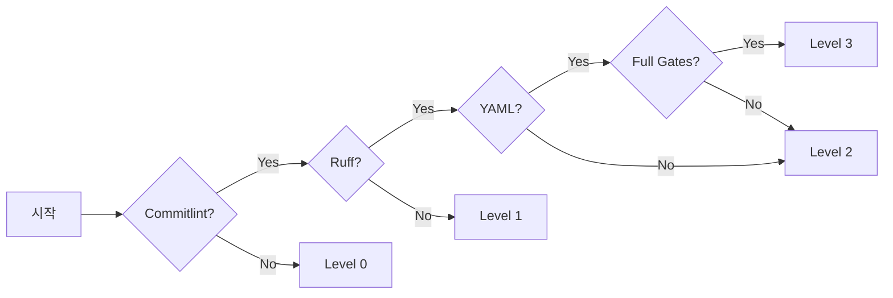

# Adoption Guide - 단계별 채택 전략

**목표**: Constitution 시스템을 부담 없이 시작하고 점진적으로 확대
**핵심**: 완벽보다는 지속 가능한 개선

## 🎯 Adoption Levels 개요

| Level | 소요 시간 | 자동화율 | 팀 부담 | ROI |
|-------|----------|---------|---------|-----|
| **Level 0** | 1일 | 20% | 최소 | 100% |
| **Level 1** | 1주 | 50% | 낮음 | 200% |
| **Level 2** | 2주 | 80% | 중간 | 300% |
| **Level 3** | 1개월 | 95% | 높음 | 377% |

## 🟢 Level 0: Minimal (최소 - 1일)

**목표**: 즉시 효과를 볼 수 있는 최소한의 변경
**자동화율**: 20%
**팀 부담**: 거의 없음

### Setup

```bash
# 1. Conventional Commits만 도입
npm install -g @commitlint/cli
echo "feat: my feature" | npx commitlint  # 테스트

# 2. 간단한 문서화 규칙
mkdir -p claudedocs/00_ACTIVE
echo "# Current Status" > claudedocs/00_ACTIVE/STATUS.md
```

### 실천 사항

```bash
# ✅ 이것만 해도 충분합니다!
git commit -m "feat: add new feature"
git commit -m "fix: resolve bug"
git commit -m "docs: update README"
```

### 효과

- ✅ 커밋 메시지 즉시 표준화
- ✅ Git log가 읽기 쉬워짐
- ✅ Semantic Release 준비 완료
- ✅ 비용: 거의 없음 (30분 설정)

### 성공 지표

- [ ] Conventional Commit 형식 준수율 >80%
- [ ] 팀원 모두 형식 이해
- [ ] 1주일 동안 문제없이 유지

### 다음 단계로 가는 조건

- ✅ 2주 이상 안정적으로 운영
- ✅ 팀원 만족도 >70%
- ✅ 더 많은 자동화 원함

## 🟡 Level 1: Light (경량 - 1주)

**목표**: 코드 품질 기초 확립
**자동화율**: 50%
**팀 부담**: 낮음

### Setup

```bash
# 1. Python 환경 + 기본 도구
python -m venv .venv
.venv\Scripts\activate  # Windows
source .venv/bin/activate  # Linux/Mac

# 2. 코드 품질 도구
pip install ruff

# 3. Constitutional Validator (선택적 사용)
python scripts/constitutional_validator.py --light
```

### 실천 사항

```bash
# 커밋 전 코드 체크
ruff check scripts/

# 3줄 이하는 YAML 불필요
git commit -m "fix(typo): correct spelling"

# 10줄 이상만 간단한 검증
ruff check modified_file.py
git commit -m "feat: add validation"
```

### 효과

- ✅ 코드 품질 향상 20%
- ✅ 버그 조기 발견
- ✅ Ruff 자동 수정으로 시간 절감
- ✅ 비용: 주 2시간

### 성공 지표

- [ ] Ruff 통과율 >90%
- [ ] 버그 감소 >15%
- [ ] 팀원 코드 리뷰 시간 10% 단축

### 다음 단계로 가는 조건

- ✅ 4주 이상 안정적으로 운영
- ✅ 팀원 만족도 >75%
- ✅ YAML 계약서 도입 준비됨

## 🟠 Level 2: Standard (표준 - 2주)

**목표**: 문서화 자동화 + 증거 기반 개발
**자동화율**: 80%
**팀 부담**: 중간

### Setup

```bash
# 1. Full 의존성 설치
pip install -r requirements.txt
pip install -r requirements-dev.txt

# 2. Pre-commit hooks
pre-commit install

# 3. Context 초기화
python scripts/context_provider.py init
```

### 실천 사항

```bash
# 주요 기능만 YAML 계약서 (10줄 이상)
cat > TASKS/FEAT-20251103-01.yaml << EOF
task_id: "FEAT-20251103-01"
title: "사용자 인증 추가"
commands:
  - exec: ["pytest", "tests/test_auth.py"]
EOF

# 실행
python scripts/task_executor.py TASKS/FEAT-20251103-01.yaml

# 자동 증거 수집 → RUNS/evidence/
# Obsidian 자동 동기화 (선택)
```

### 효과

- ✅ 문서화 90% 자동화
- ✅ 작업 재현 가능
- ✅ 지식 자산 축적 시작
- ✅ 비용: 주 5시간

### 성공 지표

- [ ] YAML 계약서 수 >5개
- [ ] Evidence 생성률 >90%
- [ ] 문서화 시간 80% 단축
- [ ] 팀원 YAML 작성 능숙

### 다음 단계로 가는 조건

- ✅ 2개월 이상 안정적으로 운영
- ✅ 팀원 만족도 >80%
- ✅ 전체 Constitution 도입 준비됨

## 🔴 Level 3: Full (완전체 - 1개월)

**목표**: 완전한 Constitution 기반 개발
**자동화율**: 95%
**팀 부담**: 높음 (초기만)

### Setup

```bash
# 1. Package 개발 모드
pip install -e .

# 2. All hooks
pre-commit install --hook-type commit-msg

# 3. Obsidian 통합 (선택)
# .env 파일 설정
OBSIDIAN_VAULT_PATH=/path/to/vault
OBSIDIAN_ENABLED=true

# Git hook 설치
python scripts/install_obsidian_auto_sync.py
```

### 실천 사항

```bash
# 모든 주요 작업은 YAML + Gates
cat > TASKS/FEAT-20251103-01.yaml << EOF
task_id: "FEAT-20251103-01"
title: "결제 시스템 추가"
gates:
  - type: "constitutional"
    articles: ["P4", "P5", "P8"]
commands:
  - exec: ["python", "scripts/implement_payment.py"]
EOF

# Constitutional 검증 자동
python scripts/task_executor.py TASKS/FEAT-20251103-01.yaml

# DeepAnalyzer 자동 실행
# SOLID, 보안, Hallucination 체크

# 세션 관리
python scripts/session_manager.py start
# ... 작업 수행 ...
python scripts/session_manager.py save
```

### 효과

- ✅ 완전한 자동화 95%
- ✅ Constitution 전체 강제
- ✅ 지식 자산 완전 축적
- ✅ ROI: 377% (연간)
- ✅ 비용: 초기 40시간 (이후 시간 절감)

### 성공 지표

- [ ] Constitutional Score >85
- [ ] 모든 조항 준수 >90%
- [ ] 품질 지표 개선 >30%
- [ ] 팀 생산성 향상 >25%

## 📈 단계별 도입 로드맵

```
Week 1: Level 0
    ├─ Day 1-2: Commitlint 설치
    ├─ Day 3-5: 팀 적응
    └─ Day 6-7: 성과 측정

Week 2-3: Level 1
    ├─ Week 2: Ruff 도입
    └─ Week 3: Constitutional Validator (light)

Week 4-5: Level 2
    ├─ Week 4: YAML 계약서 시작
    └─ Week 5: TaskExecutor 활용

Week 6-8: Level 3
    ├─ Week 6: Full setup
    ├─ Week 7: 전체 통합
    └─ Week 8: 최적화 및 안정화
```

## ⚖️ 유연성 vs 일관성 트레이드오프

| 접근법 | 유연성 | 일관성 | 품질 | 적합한 팀 |
|--------|--------|--------|------|-----------|
| **Level 0-1** | 🟢 높음 | 🔴 낮음 | 🟡 기본 | 스타트업, MVP |
| **Level 2** | 🟡 중간 | 🟡 중간 | 🟢 양호 | 성장기 팀 |
| **Level 3** | 🔴 낮음 | 🟢 높음 | 🟢 최고 | 성숙한 팀 |

**⚠️ 주의**: Level 0-1에 너무 오래 머물면 기술 부채 누적!

**권장 일정**:
- Level 0 → 1주 내 Level 1로
- Level 1 → 2개월 내 Level 2로
- Level 2 → 6개월 내 Level 3로

## 🔍 Health Check Indicators

### 건강한 적용 (Good)

```bash
✅ Override 사용률 < 10%
✅ Level 진행: 분기별 +1
✅ Commit 표준 준수: 100%
✅ PR 리뷰 시간 감소 중
```

### 경고 신호 (Warning)

```bash
⚠️ Level 0에 4주 이상 정체
⚠️ Override 사용률 > 20%
⚠️ YAML 작성률 < 30%
⚠️ 버그 증가 추세
```

### 위험 신호 (Danger)

```bash
🔴 Override가 기본이 됨
🔴 6개월째 Level 0
🔴 Constitution 완전 무시
🔴 품질 지표 악화
```

## 📊 Flexibility Monitoring

```python
# scripts/monitor_adoption.py
class AdoptionMonitor:
    def track_metrics(self):
        return {
            "override_usage": self.count_overrides(),  # 목표: <10%
            "yaml_compliance": self.check_yaml_usage(),  # 목표: >60%
            "commit_standard": self.verify_commits(),  # 목표: 100%
            "level_progress": self.check_adoption_level(),  # 목표: 분기별 +1
        }

    def alert_if_stagnant(self):
        if self.weeks_at_level_0 > 2:
            send_alert("Level 0에 너무 오래 머물고 있습니다!")
        if self.override_rate > 0.3:
            send_alert("Override 사용률이 30%를 넘었습니다!")
```

## 🎯 Level별 Skip 조건

### Level 0-1: 언제 건너뛸 수 있나?

```bash
# ✅ OK to skip:
- 1-3줄 수정 (오타, 주석)
- Documentation only
- Generated code

# ❌ Never skip:
- Conventional Commit 형식
```

### Level 2: 언제 건너뛸 수 있나?

```bash
# ✅ OK to skip YAML:
- 1-10줄 수정
- Quick fixes
- Typo corrections

# ❌ YAML required:
- 새 기능 (50줄+)
- 리팩토링 (11줄+)
- 아키텍처 변경
```

### Level 3: 언제 건너뛸 수 있나?

```bash
# ✅ OK to skip (긴급 시만):
SKIP_CONSTITUTION=true git commit -m "hotfix: critical bug"

# ❌ Never skip:
- Constitutional gates (P4, P5, P8)
- Evidence collection
```

## 🚀 Quick Decision Guide

### "현재 어떤 Level에 있나요?"



### 30초 체크리스트

```bash
# 현재 Level 확인
[ ] Commitlint 사용 중? → Level 0+
[ ] Ruff 검사 실행? → Level 1+
[ ] YAML 계약서 5개+? → Level 2+
[ ] Constitutional gates 적용? → Level 3
```

## 📞 Support & Resources

**Level 0-1 지원**:
- [QUICK_START.md](QUICK_START.md) - 5분 빠른 시작
- [CLAUDE.md](../CLAUDE.md) - 일상 명령어

**Level 2-3 지원**:
- [MIGRATION_GUIDE.md](MIGRATION_GUIDE.md) - 마이그레이션 전략
- [MULTI_SESSION_GUIDE.md](MULTI_SESSION_GUIDE.md) - 고급 워크플로우
- [TRADEOFF_ANALYSIS.md](TRADEOFF_ANALYSIS.md) - 부작용 분석

**커뮤니티**:
- GitHub Issues - 버그 리포트
- Discussions - 질문 및 아이디어

## 🎉 Remember

> **"Perfect is the Enemy of Good (But Zero is Also Bad!)"**

- **시작이 반입니다** - Level 0부터 천천히 **BUT 계속 전진**
- **80%면 충분합니다** - 완벽할 필요 없음 **BUT 20%는 너무 적음**
- **팀과 함께** - 혼자 다 하지 마세요 **BUT 누군가는 리드해야**
- **성과로 설득** - 강제하지 말고 보여주세요 **BUT 측정은 필수**

---

## 📚 See Also

**필수 읽기** (채택 전):
- **[QUICK_START.md](QUICK_START.md)** - 5분 체험으로 시작 (Level 0 실습)
- **[TRADEOFF_ANALYSIS.md](TRADEOFF_ANALYSIS.md)** - 부작용 이해 (채택 전 필독!)

**다음 단계**:
- **[MIGRATION_GUIDE.md](MIGRATION_GUIDE.md)** - 기존 프로젝트 도입 전략 (Level 1-2 도달 후)
- **[MULTI_SESSION_GUIDE.md](MULTI_SESSION_GUIDE.md)** - 멀티 AI 세션 협업 (Level 2-3 도달 후)

**일상 참조**:
- **[CLAUDE.md](../CLAUDE.md)** - 일상 개발 명령어 (Level 1+ 부터 매일 참조)

**철학 및 방향성**:
- **[NORTH_STAR.md](../NORTH_STAR.md)** - 왜 이 시스템을 사용하는가? (동기 부여)

**커뮤니티**:
- GitHub Issues - 버그 리포트
- Discussions - 질문 및 아이디어

---

**마지막 업데이트**: 2025-11-04
**대상 독자**: 모든 팀 (처음 시작하는 사람 포함)
**소요 시간**: 1일(Level 0) → 1주(Level 1) → 2주(Level 2) → 1개월(Level 3)
