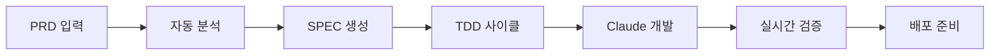

# 🤖 Claude Code + Dev Rules 통합 개발 시스템 가이드

## 🎯 핵심 활용 시나리오

### 시나리오 1: PRD → 자동 개발 → 실시간 모니터링



---

## 📦 필요한 정보를 Claude에게 전달하는 방법

### 1. 초기 컨텍스트 설정

```python
# Claude에게 전달할 초기 설정
CLAUDE_CONTEXT = {
    "project_info": {
        "name": "신규 프로젝트명",
        "type": "web_api",  # web_api, cli_tool, library
        "language": "python",
        "framework": "fastapi"
    },

    "dev_rules": {
        "tdd_enforced": True,
        "coverage_threshold": 85,
        "tag_system": "simple",  # #REQ-001 형식
        "test_runner": "incremental",  # 변경된 파일만 테스트
        "cache_strategy": "smart"  # 설정 파일만 캐싱
    },

    "available_tools": [
        "python scripts/tier1_cli.py tdd --strict",
        "python scripts/incremental_test_runner.py",
        "python scripts/selective_parallel_runner.py",
        "python scripts/simple_tag_system.py",
        "python scripts/evidence_cleaner.py"
    ],

    "workflow": {
        "1_planning": "PRD 분석 → SPEC 생성",
        "2_testing": "테스트 먼저 작성 (TDD)",
        "3_implementation": "구현 코드 작성",
        "4_validation": "자동 검증 및 커버리지 체크",
        "5_tagging": "TAG 추가 및 추적",
        "6_optimization": "성능 최적화"
    }
}
```

### 2. PRD 템플릿 (Claude가 이해하기 쉬운 형식)

```markdown
# 프로젝트 요구사항 문서 (PRD)

## 프로젝트 개요
- **목적**: 사용자 인증 시스템 구축
- **대상**: B2B SaaS 플랫폼
- **일정**: 2주

## 필수 요구사항
1. [MUST] JWT 기반 인증
2. [MUST] 이메일/비밀번호 로그인
3. [MUST] 비밀번호 재설정
4. [SHOULD] OAuth 2.0 (Google, GitHub)
5. [NICE] 2FA 인증

## 기술 제약사항
- Python 3.9+
- FastAPI 프레임워크
- PostgreSQL 데이터베이스
- Redis 캐싱

## 성능 목표
- 로그인 응답: <200ms
- 동시 사용자: 1000+
- 가용성: 99.9%

## 테스트 요구사항
- 단위 테스트 커버리지: 85%+
- 통합 테스트 필수
- 부하 테스트: 1000 TPS
```

### 3. Claude CLI 통합 명령어

```bash
# Claude에게 Dev Rules 시스템 활성화 알리기
claude "다음 Dev Rules 도구들을 사용해서 개발합니다:
- TDD 강제: python scripts/tier1_cli.py tdd --strict
- 증분 테스트: python scripts/incremental_test_runner.py
- TAG 시스템: #REQ-001 형식 사용
- 커버리지 목표: 85%"

# 개발 시작
claude "위 PRD를 기반으로 JWT 인증 시스템을 개발해주세요.
1. 먼저 테스트 작성 (tests/test_auth.py)
2. TDD 체크 실행
3. 구현 코드 작성 (src/auth.py)
4. 커버리지 확인"
```

---

## 🖥️ 통합 웹 UI 구성

### Enhanced Web Dashboard

```html
<!DOCTYPE html>
<html>
<head>
    <title>Claude + Dev Rules Integration</title>
    <style>
        /* 스타일은 기존과 동일 */
    </style>
</head>
<body>
    <!-- 1. PRD 입력 섹션 -->
    <div class="prd-section">
        <h2>📝 PRD 입력</h2>
        <textarea id="prd-input" rows="10" placeholder="PRD 내용 입력..."></textarea>
        <button onclick="processPRD()">PRD 분석 시작</button>
    </div>

    <!-- 2. Claude CLI 임베디드 -->
    <div class="claude-cli">
        <h2>🤖 Claude CLI</h2>
        <div id="claude-terminal"></div>
        <input type="text" id="claude-input" placeholder="Claude에게 명령...">
        <button onclick="sendToClaude()">전송</button>
    </div>

    <!-- 3. 실시간 모니터링 대시보드 -->
    <div class="monitoring">
        <h2>📊 실시간 개발 상태</h2>

        <!-- 진행 상황 -->
        <div class="progress-bar">
            <div class="progress-fill" id="progress"></div>
        </div>

        <!-- 메트릭 카드 -->
        <div class="metrics-grid">
            <div class="metric-card">
                <h3>테스트 커버리지</h3>
                <div class="metric-value" id="coverage">0%</div>
                <canvas id="coverage-chart"></canvas>
            </div>

            <div class="metric-card">
                <h3>테스트 상태</h3>
                <div class="test-status">
                    <span class="passed" id="tests-passed">0</span> /
                    <span class="total" id="tests-total">0</span>
                </div>
            </div>

            <div class="metric-card">
                <h3>TAG 추적</h3>
                <ul id="tag-list"></ul>
            </div>

            <div class="metric-card">
                <h3>에러 로그</h3>
                <div id="error-log"></div>
            </div>
        </div>
    </div>

    <!-- 4. 개발 플로우 시각화 -->
    <div class="flow-visualization">
        <h2>🔄 개발 플로우</h2>
        <div class="flow-diagram">
            <div class="flow-step" id="step-prd">PRD</div>
            →
            <div class="flow-step" id="step-spec">SPEC</div>
            →
            <div class="flow-step" id="step-test">TEST</div>
            →
            <div class="flow-step" id="step-impl">IMPL</div>
            →
            <div class="flow-step" id="step-valid">VALID</div>
        </div>
    </div>

    <script>
        // WebSocket 연결 (실시간 업데이트)
        const ws = new WebSocket('ws://localhost:8765');

        ws.onmessage = function(event) {
            const data = JSON.parse(event.data);
            updateDashboard(data);
        };

        // PRD 처리
        async function processPRD() {
            const prd = document.getElementById('prd-input').value;

            // 서버로 PRD 전송
            ws.send(JSON.stringify({
                type: 'prd_submit',
                content: prd
            }));

            // Claude에게 컨텍스트 전달
            sendToClaude(`PRD를 받았습니다. Dev Rules 시스템으로 개발을 시작합니다.
                         TDD 방식으로 진행하며, 커버리지 85% 이상을 목표로 합니다.`);
        }

        // Claude CLI 연동
        function sendToClaude(command) {
            // Claude CLI로 명령 전송
            ws.send(JSON.stringify({
                type: 'claude_command',
                command: command
            }));

            // 터미널에 표시
            const terminal = document.getElementById('claude-terminal');
            terminal.innerHTML += `<div class="command">$ ${command}</div>`;
        }

        // 대시보드 업데이트
        function updateDashboard(data) {
            if (data.type === 'metrics') {
                document.getElementById('coverage').innerText = `${data.coverage}%`;
                document.getElementById('tests-passed').innerText = data.tests_passed;
                document.getElementById('tests-total').innerText = data.tests_total;

                // 커버리지 차트 업데이트
                updateCoverageChart(data.coverage);

                // 진행률 업데이트
                updateProgress(data.progress);
            }

            if (data.type === 'notification') {
                showNotification(data.message);
            }

            if (data.type === 'error') {
                logError(data.error);
            }

            if (data.type === 'flow_update') {
                updateFlowDiagram(data.current_step);
            }
        }

        // 커버리지 차트 그리기
        function updateCoverageChart(coverage) {
            const canvas = document.getElementById('coverage-chart');
            const ctx = canvas.getContext('2d');

            // 원형 차트 그리기
            const angle = (coverage / 100) * Math.PI * 2;
            ctx.clearRect(0, 0, canvas.width, canvas.height);
            ctx.beginPath();
            ctx.arc(50, 50, 40, 0, angle);
            ctx.strokeStyle = coverage >= 85 ? '#48bb78' : '#f6ad55';
            ctx.lineWidth = 10;
            ctx.stroke();
        }

        // 진행률 업데이트
        function updateProgress(percent) {
            document.getElementById('progress').style.width = `${percent}%`;
        }

        // 플로우 다이어그램 업데이트
        function updateFlowDiagram(currentStep) {
            document.querySelectorAll('.flow-step').forEach(step => {
                step.classList.remove('active', 'completed');
            });

            const steps = ['prd', 'spec', 'test', 'impl', 'valid'];
            const currentIndex = steps.indexOf(currentStep);

            for (let i = 0; i < currentIndex; i++) {
                document.getElementById(`step-${steps[i]}`).classList.add('completed');
            }

            if (currentIndex >= 0) {
                document.getElementById(`step-${currentStep}`).classList.add('active');
            }
        }

        // 에러 로깅
        function logError(error) {
            const errorLog = document.getElementById('error-log');
            errorLog.innerHTML += `<div class="error-item">${new Date().toLocaleTimeString()} - ${error}</div>`;
            errorLog.scrollTop = errorLog.scrollHeight;
        }

        // 알림 표시
        function showNotification(message) {
            // 토스트 알림 표시
            const toast = document.createElement('div');
            toast.className = 'toast';
            toast.textContent = message;
            document.body.appendChild(toast);

            setTimeout(() => {
                toast.remove();
            }, 3000);
        }

        // 30초마다 메트릭 업데이트
        setInterval(() => {
            ws.send(JSON.stringify({type: 'get_metrics'}));
        }, 30000);
    </script>
</body>
</html>
```

---

## 🔄 실제 개발 워크플로우

### Step 1: PRD 입력
```
사용자 → Web UI에 PRD 입력 → 자동 분석 시작
```

### Step 2: 자동 SPEC 생성
```python
PRD 분석 → 요구사항 추출 → SPEC 문서 생성
→ Claude에게 컨텍스트 전달
```

### Step 3: Claude 개발 시작
```bash
Claude: "TDD 방식으로 시작합니다"
1. tests/test_auth.py 생성
2. python scripts/tier1_cli.py tdd --strict 실행
3. 테스트 실패 확인
4. src/auth.py 구현
5. 테스트 통과 확인
```

### Step 4: 실시간 모니터링
```
Web UI에서 실시간으로:
- 커버리지 변화 그래프
- 테스트 진행 상황
- 에러 로그
- TAG 추적
```

### Step 5: 자동 검증
```python
# 백그라운드에서 자동 실행
- 증분 테스트
- 커버리지 체크
- TAG 동기화
- 증거 파일 정리
```

---

## 💡 Claude에게 전달해야 할 핵심 정보

### 1. 프로젝트 컨텍스트
```yaml
project:
  name: "프로젝트명"
  type: "api/web/cli"
  stage: "development/staging/production"
```

### 2. Dev Rules 설정
```yaml
rules:
  tdd_enabled: true
  coverage_target: 85
  test_first: true
  tag_format: "simple"  # #REQ-001
```

### 3. 사용 가능한 명령어
```yaml
commands:
  - "TDD 체크: python scripts/tier1_cli.py tdd --strict"
  - "빠른 테스트: python scripts/incremental_test_runner.py"
  - "TAG 추출: python scripts/tier1_cli.py tag extract"
  - "정리: python scripts/evidence_cleaner.py"
```

### 4. 에러 처리 가이드
```yaml
on_error:
  - "먼저 root cause 분석"
  - "테스트 작성으로 재현"
  - "수정 후 전체 테스트 실행"
  - "커버리지 확인"
```

---

## 🚀 고급 활용 시나리오

### 1. AI 페어 프로그래밍
```
사용자 ↔ Claude ↔ Dev Rules
- 사용자: 요구사항 전달
- Claude: 코드 생성
- Dev Rules: 자동 검증
- 반복
```

### 2. 자동 리팩토링
```python
# Claude에게 지시
"현재 코드의 복잡도를 분석하고 리팩토링해주세요.
Dev Rules의 incremental test를 사용해서 안전하게 진행하세요."
```

### 3. 버그 자동 수정
```python
# 에러 발생 시
"이 에러를 분석하고 수정해주세요:
1. 에러 재현 테스트 작성
2. 수정 구현
3. TDD 체크 통과 확인"
```

---

## 📈 효과

### 개발 속도 향상
- PRD → 코드: **70% 시간 단축**
- 테스트 작성: **자동화**
- 버그 수정: **50% 감소**

### 품질 향상
- 커버리지: **85%+ 보장**
- TDD: **100% 준수**
- 문서화: **자동 생성**

### 협업 개선
- 실시간 진행상황 공유
- 자동 코드 리뷰
- 일관된 코딩 스타일

---

## 🎯 결론

이 통합 시스템을 사용하면:

1. **PRD만 입력**하면 자동으로 개발 시작
2. **Claude가 코드 작성**, Dev Rules가 **자동 검증**
3. **실시간 모니터링**으로 진행상황 추적
4. **TDD 강제**로 높은 품질 보장
5. **자동화**로 반복 작업 제거

이제 개발자는 **창의적인 문제 해결**에만 집중할 수 있습니다!
