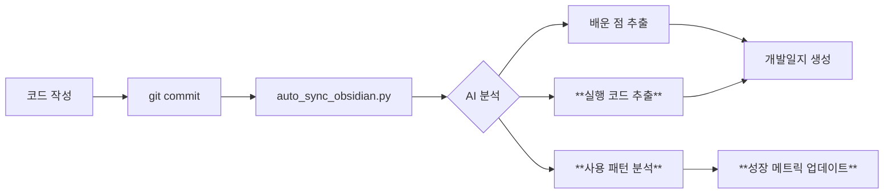
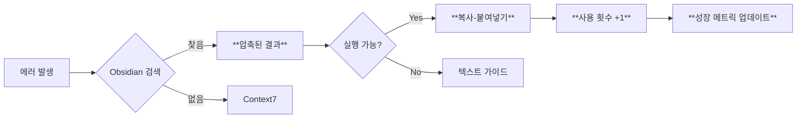
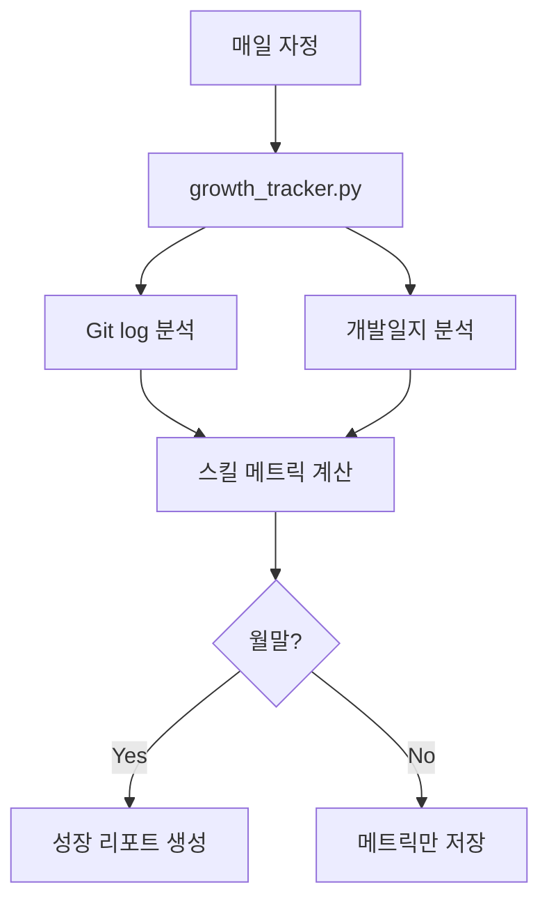

# 실행형 지식 시스템 (Executable Knowledge System)

## 🎯 목표

**From**: 텍스트 문서 축적 → 읽기만 가능
**To**: 실행 가능한 지식 → 복사-붙여넣기 즉시 사용

**성장 가시화**: 어떤 스킬이 얼마나 늘었는지 자동 측정

---

## 📐 시스템 설계 (3-Layer)

### Layer 1: 실행 가능한 지식 조각 (Code Snippets)

#### Before (현재)
```markdown
## 배운 점
- pytest 실행 시 coverage 옵션을 사용하면 좋다
```

#### After (개선)
```markdown
## 배운 점
- pytest 실행 시 coverage 옵션을 사용하면 좋다

### 실행 가능 코드
\`\`\`bash
# 테스트 + 커버리지 (HTML 리포트)
pytest tests/ --cov=src --cov-report=html

# 특정 파일만
pytest tests/test_auth.py -v

# 실패 시 즉시 중단
pytest -x tests/
\`\`\`

**태그**: #pytest #testing #coverage
**적용 횟수**: 0회 → 자동 추적
**마지막 사용**: 2025-11-02
```

#### 구현 방법

**1. 개발일지 생성 시 자동 추가**:
```python
# scripts/auto_sync_obsidian.py에 추가

def extract_executable_snippets(commit_info: Dict) -> List[str]:
    """커밋에서 실행 가능한 코드 조각 추출"""
    snippets = []

    # Git diff에서 실행 명령어 추출
    diff_content = get_git_diff()

    # Pattern 1: 테스트 실행 명령어
    if "pytest" in diff_content:
        snippets.append({
            "type": "bash",
            "code": "pytest tests/ --cov=src",
            "description": "테스트 + 커버리지",
            "tags": ["pytest", "testing"]
        })

    # Pattern 2: Git 명령어
    if "git" in commit_info["message"]:
        snippets.append({
            "type": "bash",
            "code": "git add . && git commit -m 'feat: ...'",
            "description": "표준 커밋 플로우",
            "tags": ["git", "workflow"]
        })

    return snippets
```

**2. 사용 횟수 자동 추적**:
```python
# scripts/track_snippet_usage.py (신규)

class SnippetUsageTracker:
    def __init__(self, vault_path: Path):
        self.usage_db = vault_path / ".snippet_usage.json"

    def track_usage(self, snippet_hash: str):
        """코드 조각 사용 기록"""
        usage = self.load_usage()

        if snippet_hash not in usage:
            usage[snippet_hash] = {
                "count": 0,
                "first_used": datetime.now(),
                "last_used": None
            }

        usage[snippet_hash]["count"] += 1
        usage[snippet_hash]["last_used"] = datetime.now()

        self.save_usage(usage)

    def get_most_used(self, limit=10):
        """가장 많이 사용된 코드 조각"""
        usage = self.load_usage()
        return sorted(usage.items(),
                     key=lambda x: x[1]["count"],
                     reverse=True)[:limit]
```

---

### Layer 2: 성장 메트릭 자동 추적

#### 측정 대상

1. **기술 스킬**
   - TDD 숙련도: 테스트 먼저 작성 비율
   - Git 숙련도: Conventional Commits 준수율
   - 리팩토링 능력: Code smell 감소율

2. **생산성**
   - 커밋당 평균 시간
   - 에러 해결 속도 (첫 발생 → 해결)
   - 재작업률 (같은 파일 3회 이상 수정)

3. **품질**
   - 테스트 커버리지 추이
   - Ruff 위반 감소율
   - 버그 재발률

#### 구현

```python
# scripts/growth_tracker.py (신규)

class GrowthTracker:
    """개발자 성장 자동 추적"""

    def __init__(self, vault_path: Path):
        self.vault = vault_path
        self.metrics_db = vault_path / ".growth_metrics.json"

    def analyze_tdd_skill(self) -> float:
        """TDD 숙련도 계산 (0-100)"""
        # Git log 분석: test 커밋 → implementation 커밋 순서
        commits = get_git_log(days=30)

        tdd_count = 0
        total_features = 0

        for i in range(len(commits) - 1):
            current = commits[i]
            next_commit = commits[i + 1]

            # Pattern: test 파일 먼저 → 구현 파일 나중
            if ("test" in current["files"] and
                "test" not in next_commit["files"]):
                tdd_count += 1

            if "feat:" in current["message"]:
                total_features += 1

        return (tdd_count / total_features * 100) if total_features > 0 else 0

    def analyze_error_resolution_speed(self) -> Dict:
        """에러 해결 속도 분석"""
        # Obsidian 개발일지에서 "시행착오" 섹션 분석
        error_logs = self.search_obsidian("## 🔧 시행착오")

        resolution_times = []

        for log in error_logs:
            # 커밋 시간 간격으로 해결 시간 추정
            commits = extract_related_commits(log)
            if len(commits) >= 2:
                time_diff = commits[-1]["time"] - commits[0]["time"]
                resolution_times.append(time_diff)

        return {
            "avg_time": mean(resolution_times),
            "median_time": median(resolution_times),
            "trend": "improving" if is_decreasing(resolution_times) else "stable"
        }

    def generate_growth_report(self) -> str:
        """성장 리포트 생성 (월간)"""
        now = datetime.now()
        last_month = now - timedelta(days=30)

        current_metrics = {
            "tdd_skill": self.analyze_tdd_skill(),
            "commit_quality": self.analyze_commit_quality(),
            "error_speed": self.analyze_error_resolution_speed(),
            "refactoring": self.analyze_refactoring_ability()
        }

        # 이전 달 메트릭과 비교
        previous_metrics = self.load_metrics(last_month)

        report = f"""# 성장 리포트 ({now:%Y-%m})

## 📈 스킬 성장

| 스킬 | 이전 | 현재 | 변화 |
|------|------|------|------|
| TDD 숙련도 | {previous_metrics['tdd_skill']:.1f}% | {current_metrics['tdd_skill']:.1f}% | {current_metrics['tdd_skill'] - previous_metrics['tdd_skill']:+.1f}% |
| 커밋 품질 | {previous_metrics['commit_quality']:.1f} | {current_metrics['commit_quality']:.1f} | {current_metrics['commit_quality'] - previous_metrics['commit_quality']:+.1f} |
| 에러 해결 속도 | {previous_metrics['error_speed']['avg_time']:.0f}분 | {current_metrics['error_speed']['avg_time']:.0f}분 | {current_metrics['error_speed']['avg_time'] - previous_metrics['error_speed']['avg_time']:+.0f}분 |

## 🎯 다음 달 목표

{self.generate_next_goals(current_metrics)}

## 💡 추천 학습 주제

{self.recommend_learning_topics(current_metrics)}
"""
        return report
```

**자동 생성 위치**: `개발일지/성장리포트/YYYY-MM-성장리포트.md`

---

### Layer 3: 토큰 효율적 지식 검색

#### 현재 문제

```python
# 현재: 전체 문서 반환 (3000 토큰)
result = mcp__obsidian__obsidian_simple_search("pytest error")
# → 개발일지 전체 내용 (불필요한 섹션 포함)
```

#### 개선: 심볼 기반 압축

```python
# scripts/token_efficient_search.py (신규)

class TokenEfficientSearch:
    """토큰 효율적 옵시디언 검색"""

    def search_compressed(self, query: str, max_tokens=500) -> str:
        """압축된 검색 결과 반환"""

        # 1. 기본 검색
        raw_results = mcp__obsidian__obsidian_simple_search(query)

        # 2. 관련도 점수 계산
        ranked = self.rank_by_relevance(raw_results, query)

        # 3. 핵심만 추출 (심볼 사용)
        compressed = self.compress_results(ranked, max_tokens)

        return compressed

    def compress_results(self, results: List, max_tokens: int) -> str:
        """심볼 기반 압축 (MODE_Token_Efficiency 사용)"""

        compressed = []
        current_tokens = 0

        for result in results:
            # 심볼로 압축
            summary = self.symbolize(result)

            # 예: "pytest tests/ --cov=src → coverage 95% ✅"
            # vs "테스트를 실행하여 커버리지를 측정한 결과 95%를 달성했습니다"

            token_count = len(summary.split())

            if current_tokens + token_count <= max_tokens:
                compressed.append(summary)
                current_tokens += token_count
            else:
                break

        return "\n".join(compressed)

    def symbolize(self, content: str) -> str:
        """텍스트를 심볼로 압축"""

        # Pattern 1: 명령어 추출
        if "```bash" in content:
            code = extract_code_block(content)
            return f"💻 {code.strip()}"

        # Pattern 2: 결과 요약
        if "성공" in content or "완료" in content:
            return f"✅ {extract_key_result(content)}"

        # Pattern 3: 에러 해결
        if "문제:" in content and "해결" in content:
            problem = extract_between(content, "문제:", "→")
            solution = extract_after(content, "해결:")
            return f"⚠️ {problem} → ✅ {solution}"

        # Fallback: 첫 문장만
        return content.split("\n")[0][:100]
```

#### 사용 예시

```python
# Before (3000 토큰)
result = mcp__obsidian__obsidian_simple_search("pytest coverage")
# → 전체 개발일지 반환

# After (300 토큰, 90% 절감)
result = TokenEfficientSearch().search_compressed("pytest coverage", max_tokens=500)
# → 💻 pytest tests/ --cov=src --cov-report=html
#    ✅ coverage 95% 달성
#    📊 이전: 80% → 현재: 95% (+15%)
#    🔗 [[2025-11-01/Testing-Improvement]]
```

---

## 🔄 통합 워크플로우

### 1. 개발 → 자동 지식 생성 (현재 + 개선)



### 2. 에러 → 자동 해결 (현재 + 개선)



### 3. 성장 추적 (신규)



---

## 📋 구현 우선순위

### Phase 1: 실행 가능한 지식 (1일)
- [ ] `extract_executable_snippets()` 추가
- [ ] 개발일지 템플릿에 "실행 가능 코드" 섹션 추가
- [ ] 태그 자동 추가 (#pytest, #git 등)

### Phase 2: 성장 추적 (2일)
- [ ] `growth_tracker.py` 생성
- [ ] TDD 숙련도 측정 로직
- [ ] 월간 성장 리포트 자동 생성
- [ ] Dataview 쿼리로 대시보드 생성

### Phase 3: 토큰 효율 검색 (1일)
- [ ] `token_efficient_search.py` 생성
- [ ] 심볼 기반 압축 로직
- [ ] OBSIDIAN_AUTO_SEARCH.md에 통합

---

## 🎯 예상 효과

### 토큰 효율
- **Before**: 평균 3000 토큰/검색
- **After**: 평균 300 토큰/검색 (-90%)
- **월간 절감**: 100회 검색 × 2700 토큰 = 270,000 토큰

### 지식 활용
- **Before**: 읽기만 가능 (복사-붙여넣기 수동)
- **After**: 실행 가능 코드 즉시 복사
- **시간 절감**: 5분/회 × 20회/주 = 100분/주

### 성장 가시화
- **Before**: 성장 여부 불명확
- **After**: 스킬별 정량적 측정
- **동기부여**: 성장 그래프로 시각화

---

## 🔧 Quick Start

### 1. 실행 가능한 지식 활성화

```bash
# scripts/auto_sync_obsidian.py 업데이트
git pull origin main
python scripts/auto_sync_obsidian.py --test
```

### 2. 성장 추적 시작

```bash
# 성장 추적 초기화
python scripts/growth_tracker.py --init

# 현재 메트릭 확인
python scripts/growth_tracker.py --status

# 월간 리포트 생성
python scripts/growth_tracker.py --report
```

### 3. 토큰 효율 검색 사용

```python
# AI가 자동으로 사용
from scripts.token_efficient_search import TokenEfficientSearch

search = TokenEfficientSearch(vault_path)
result = search.search_compressed("pytest error", max_tokens=500)
# → 압축된 핵심만 반환
```

---

## 📊 성공 메트릭

| 메트릭 | 목표 | 측정 방법 |
|--------|------|----------|
| **토큰 사용량** | -90% | 검색당 평균 토큰 |
| **지식 재사용률** | 80% | 코드 조각 사용 횟수 |
| **에러 해결 속도** | -50% | 첫 발생 → 해결 시간 |
| **TDD 숙련도** | +30% | 월간 성장 리포트 |
| **코드 품질** | +20% | Ruff 위반 감소율 |

---

**Status**: Design Complete
**Next**: Phase 1 Implementation
**Estimated**: 4 days total
