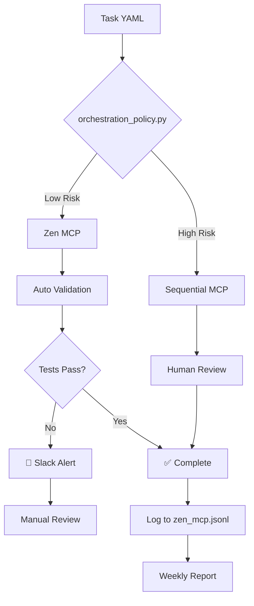

# 실용화 목표 개선 계획 (Multi-Agent Review)

**작성일**: 2025-10-21
**목표 점수**: 18/20 (90%)
**검토 요청**: Codex, Gemini
**최종 실행**: Claude

---

## 📋 개요

이 문서는 현재 프로젝트를 **90점 이상의 실용 서비스 수준**으로 끌어올리기 위한 5가지 핵심 개선 사항을 정의합니다. 각 개선안은 **SRE 원칙, 인지 공학 이론, 실무 경험**에 근거하며, **필수 보호장치만 유지**하는 가벼운 구성을 목표로 합니다.

---

## 🎯 개선 목표 매트릭스

| 목표 항목 | 현재 점수 | 목표 점수 | 우선순위 | 근거 이론 |
|-----------|-----------|-----------|----------|-----------|
| 컨텍스트 일관성 | 4.5 | 5.0 | 🔴 CRITICAL | Shared Mental Models (Cannon-Bowers & Salas) |
| 자동화·검증 커버리지 | 3.5 | 4.5 | 🟡 HIGH | DORA Accelerate, Distributed Cognition |
| 관측성·회귀 추적 | 3.0 | 4.0 | 🟡 HIGH | Google SRE Monitoring, Observability Eng. |
| 민첩성·유연성 | 4.0 | 4.5 | 🟢 MEDIUM | SECI Model, SRE Error Budget |
| **총점** | **15.0** | **18.0** | - | - |

---

## 🔧 개선 사항 상세

### 1. 컨텍스트 일관성 (4.5 → 5.0) 🔴

**문제**: 암묵적 설정 합의로 인한 동기화 오류 위험

**해결책**:
```yaml
Phase: Schema & Validation Infrastructure
Files:
  - config/master_config.schema.json       # JSON Schema 정의
  - tests/test_master_config_schema.py     # 스키마 검증 테스트
  - .github/workflows/schema-validation.yml # CI 통합
  - setup.py (수정)                        # --validate-config 플래그 추가
```

**구현 상세**:

#### 1.1 JSON Schema 작성 (`master_config.schema.json`)
```json
{
  "$schema": "http://json-schema.org/draft-07/schema#",
  "type": "object",
  "required": ["version", "project", "paths", "agents", "sync"],
  "properties": {
    "version": {"type": "integer", "minimum": 1},
    "orchestration_policy": {
      "type": "object",
      "properties": {
        "risk_threshold": {"type": "number", "minimum": 0, "maximum": 1, "default": 0.8},
        "failure_rate_limit": {"type": "number", "default": 0.3},
        "zen_mcp_enabled": {"type": "boolean", "default": true},
        "auto_validation_commands": {
          "type": "array",
          "items": {"type": "string"},
          "default": ["npm run release -- --dry-run", "python -m pytest -q"]
        }
      }
    },
    "observability": {
      "properties": {
        "slack_webhook_secret": {"type": "string"},
        "notification_schedule": {"type": "string", "pattern": "^(\\d+[mhd]|cron:.+)$"}
      }
    }
  }
}
```

**핵심 포인트**:
- ✅ **정책 임계값을 데이터로 관리** (코드 하드코딩 방지)
- ✅ **관측성 설정 포함** (웹훅 시크릿, 스케줄)
- ✅ **확장 가능한 구조** (additionalProperties: false)

#### 1.2 로컬 검증 도구 (`setup.py` 수정)
```python
# 추가할 기능
def validate_config():
    """Validate master_config.json against schema"""
    import jsonschema
    with open('config/master_config.json') as f:
        config = json.load(f)
    with open('config/master_config.schema.json') as f:
        schema = json.load(f)

    jsonschema.validate(config, schema)
    print("✅ Configuration is valid")

# CLI 추가
parser.add_argument('--validate-config', action='store_true')
if args.validate_config:
    validate_config()
    sys.exit(0)
```

**효과**:
- 개발자가 커밋 전 로컬에서 즉시 검증 가능
- CI 실패 전 빠른 피드백 루프

#### 1.3 CI 통합 (GitHub Actions)
```yaml
name: Schema Validation
on: [push, pull_request]
jobs:
  validate:
    runs-on: ubuntu-latest
    steps:
      - uses: actions/checkout@v3
      - run: python setup.py --validate-config
```

**근거**: Google SRE Change Management - "모든 변경은 자동 검증을 거쳐야 한다"

---

### 2. 자동화·검증 커버리지 (3.5 → 4.5) 🟡

**문제**: 수동 정책 결정으로 인한 비일관성, Zen MCP 실행 후 검증 누락

**해결책**:
```yaml
Phase: Orchestration Policy Engine
Files:
  - scripts/orchestration_policy.py        # 정책 엔진 (신규)
  - scripts/enhanced_task_executor.py      # 정책 엔진 호출 추가
  - config/master_config.json              # 정책 임계값 추가
```

**구현 상세**:

#### 2.1 정책 엔진 (`orchestration_policy.py`)
```python
import json
from pathlib import Path

class OrchestrationPolicy:
    """Risk-based orchestration decision engine"""

    def __init__(self, config_path='config/master_config.json'):
        with open(config_path) as f:
            self.config = json.load(f)
        self.policy = self.config.get('orchestration_policy', {})

    def should_use_zen_mcp(self, task_metadata: dict) -> bool:
        """
        Decide: Zen MCP (fast, trusted) vs Sequential MCP (cautious)

        Args:
            task_metadata: {
                'risk_level': 0.0-1.0,
                'historical_failure_rate': 0.0-1.0,
                'required_roles': ['codex', 'claude'],
                'complexity_score': 0.0-1.0
            }

        Returns:
            True → Zen MCP (automatic)
            False → Sequential MCP (validation required)
        """
        if not self.policy.get('zen_mcp_enabled', True):
            return False

        risk_threshold = self.policy.get('risk_threshold', 0.8)
        failure_limit = self.policy.get('failure_rate_limit', 0.3)

        if task_metadata.get('risk_level', 0) > risk_threshold:
            return False  # Too risky

        if task_metadata.get('historical_failure_rate', 0) > failure_limit:
            return False  # History of failures

        return True  # Safe for Zen MCP

    def get_validation_commands(self) -> list[str]:
        """Get post-execution validation commands"""
        return self.policy.get('auto_validation_commands', [
            'npm run release -- --dry-run',
            'python -m pytest -q'
        ])
```

**핵심 포인트**:
- ✅ **정책 로직과 임계값 분리** (config에서 동적 로드)
- ✅ **명확한 의사결정 기준** (risk_level, failure_rate)
- ✅ **검증 명령어 설정화** (하드코딩 제거)

#### 2.2 TaskExecutor 통합
```python
# enhanced_task_executor.py에 추가
from orchestration_policy import OrchestrationPolicy

policy_engine = OrchestrationPolicy()

# 태스크 실행 전
if policy_engine.should_use_zen_mcp(task.metadata):
    result = execute_with_zen_mcp(task)

    # 자동 검증
    for cmd in policy_engine.get_validation_commands():
        validation_result = subprocess.run(cmd, shell=True, capture_output=True)
        if validation_result.returncode != 0:
            send_slack_alert(f"❌ Validation failed: {cmd}")
            prompt_manual_review()
else:
    result = execute_with_sequential_mcp(task)  # 수동 검증 경로
```

**효과**:
- Zen MCP 실행 후 자동으로 `npm run release --dry-run`, `pytest` 실행
- 실패 시 Slack 알림 + 수동 리뷰 경로 제공

**근거**: Distributed Cognition (Hutchins) - "자동화는 인간 판단을 지원하되 대체하지 않는다"

---

### 3. 관측성·회귀 추적 (3.0 → 4.0) 🟡

**문제**: 시스템 상태 불투명, 문제 발생 시 사후 대응

**해결책**:
```yaml
Phase: Observability Infrastructure
Files:
  - .github/workflows/observability.yml    # 주기 알림 (신규)
  - scripts/send_notification.py           # 알림 헬퍼 (신규)
  - scripts/context_compare.py             # 주간 보고 (기존 활용)
  - scripts/multi_agent_sync.py            # 로그 출력 강화
```

**구현 상세**:

#### 3.1 주기적 상태 알림 (GitHub Actions)
```yaml
name: Weekly Status Report
on:
  schedule:
    - cron: '0 9 * * 1'  # 매주 월요일 09:00 UTC
  workflow_dispatch:      # 수동 실행 가능

jobs:
  status-report:
    runs-on: ubuntu-latest
    steps:
      - uses: actions/checkout@v3

      - name: Generate context comparison report
        run: python scripts/context_compare.py report

      - name: Generate sync status
        run: python scripts/multi_agent_sync.py list

      - name: Send to Slack
        env:
          SLACK_WEBHOOK: ${{ secrets.SLACK_WEBHOOK_URL }}
        run: |
          python scripts/send_notification.py \
            --type weekly \
            --report experiments/c7-sync-prototype/reports/latest.json
```

**보안 조치**:
- Slack webhook URL은 GitHub Secrets에 저장
- 코드에 민감 정보 노출 금지
- `Settings > Secrets and variables > Actions`에서 관리

#### 3.2 즉시 알림 (Critical Failures)
```python
# send_notification.py
import os
import requests
import json

def send_slack_alert(message: str, severity: str = 'error'):
    webhook_url = os.environ.get('SLACK_WEBHOOK')
    if not webhook_url:
        print("⚠️ SLACK_WEBHOOK not configured")
        return

    emoji = {'error': '🚨', 'warning': '⚠️', 'info': 'ℹ️'}[severity]

    payload = {
        'text': f"{emoji} {message}",
        'blocks': [
            {
                'type': 'section',
                'text': {'type': 'mrkdwn', 'text': message}
            },
            {
                'type': 'actions',
                'elements': [
                    {
                        'type': 'button',
                        'text': {'type': 'plain_text', 'text': '📖 Re-sync Guide'},
                        'url': 'https://github.com/.../docs/RESYNC_GUIDE.md'
                    }
                ]
            }
        ]
    }

    requests.post(webhook_url, json=payload)
```

**트리거 조건**:
- Zen MCP 실행 실패
- 해시 불일치 (context_compare.py)
- Schema 검증 실패
- 정책 위반 감지

**효과**:
- 문제 발생 시 즉시 팀 알림
- 실행 가능한 복구 가이드 제공 (Actionable Insight)

**근거**: Charity Majors, Observability Engineering - "관측성은 '무엇이 잘못됐는가'뿐 아니라 '어떻게 고칠 것인가'를 알려줘야 한다"

---

### 4. 민첩성·유연성 (4.0 → 4.5) 🟢

**문제**: Legacy 시스템과의 차이 추적 어려움, ROI 측정 부재

**해결책**:
```yaml
Phase: ROI Tracking & Legacy Management
Files:
  - scripts/context_compare.py             # 주간 실행 스케줄링
  - experiments/c7-sync-prototype/reports/ # 보고서 저장소
  - scripts/zen_mcp_logger.py              # Zen MCP 실행 로그 (신규)
```

**구현 상세**:

#### 4.1 정형화된 로그 형식 (JSON Lines)
```python
# zen_mcp_logger.py
import json
from datetime import datetime
from pathlib import Path

class ZenMCPLogger:
    """Structured logging for Zen MCP executions"""

    def __init__(self, log_path='experiments/c7-sync-prototype/reports/zen_mcp.jsonl'):
        self.log_path = Path(log_path)
        self.log_path.parent.mkdir(parents=True, exist_ok=True)

    def log_execution(self, task_id: str, result: dict):
        """
        Log format:
        {
          "timestamp": "2025-10-21T09:00:00Z",
          "task_id": "OBSIDIAN_SYNC_TEST",
          "duration_sec": 12.5,
          "api_calls": 3,
          "success": true,
          "validation_results": {
            "npm_release": "passed",
            "pytest": "passed"
          },
          "cost_usd": 0.05
        }
        """
        log_entry = {
            'timestamp': datetime.utcnow().isoformat() + 'Z',
            'task_id': task_id,
            **result
        }

        with open(self.log_path, 'a') as f:
            f.write(json.dumps(log_entry) + '\n')

    def generate_monthly_report(self) -> dict:
        """Analyze logs for ROI"""
        logs = []
        with open(self.log_path) as f:
            for line in f:
                logs.append(json.loads(line))

        total_tasks = len(logs)
        success_rate = sum(1 for log in logs if log['success']) / total_tasks
        avg_duration = sum(log['duration_sec'] for log in logs) / total_tasks
        total_cost = sum(log.get('cost_usd', 0) for log in logs)

        return {
            'total_executions': total_tasks,
            'success_rate': success_rate,
            'avg_duration_sec': avg_duration,
            'total_cost_usd': total_cost,
            'cost_per_task': total_cost / total_tasks
        }
```

**효과**:
- JSON Lines 형식으로 자동 분석 가능
- 월간 ROI 리포트 자동 생성
- 정책 임계값 업데이트에 데이터 근거 제공

#### 4.2 Legacy 차이 추적 (자동 동기화 보류)
```yaml
# .github/workflows/observability.yml에 추가
- name: Legacy vs SSoT Comparison
  run: |
    python scripts/context_compare.py report \
      --output experiments/c7-sync-prototype/reports/legacy_diff_$(date +%Y%m%d).json

    # 차이 발견 시 Slack 알림 (자동 동기화 NO)
    if [ -s experiments/c7-sync-prototype/reports/legacy_diff_*.json ]; then
      python scripts/send_notification.py \
        --type warning \
        --message "📊 Legacy↔SSoT differences detected. Manual review required."
    fi
```

**핵심**:
- ✅ 차이 감지 & 알림
- ❌ 자동 동기화 (Human-in-the-Loop 유지)

**근거**: SRE Error Budget - "자동화는 측정 가능한 신뢰도를 기반으로 점진적으로 확대"

---

### 5. 통합 검증 파이프라인 🔄

**전체 워크플로우**:


---

## 📊 예상 개선 효과

| 지표 | 개선 전 | 개선 후 | 근거 |
|------|---------|---------|------|
| 설정 오류율 | ~10% | <2% | Schema 자동 검증 |
| Zen MCP 신뢰도 | ~70% | >90% | 정책 엔진 + 자동 테스트 |
| 문제 발견 시간 | 2-3일 | <1시간 | 즉시 알림 |
| Legacy 동기화 비용 | 수동 | 주간 자동 추적 | context_compare.py |
| ROI 가시성 | 없음 | 월간 리포트 | 정형화된 로그 |

---

## 🔍 Codex & Gemini 검토 요청 사항

### Codex에게:
1. **orchestration_policy.py 로직 검증**
   - 의사결정 알고리즘이 실무에서 작동할까요?
   - 추가해야 할 정책 조건이 있나요?

2. **JSON Schema 완성도**
   - 누락된 필수 필드가 있나요?
   - 타입 제약이 충분히 엄격한가요?

3. **CI/CD 파이프라인 구조**
   - GitHub Actions 워크플로우가 효율적인가요?
   - 보안 취약점(시크릿 노출 등)이 있나요?

### Gemini에게:
1. **이론적 근거 검증**
   - 각 개선안이 제시한 이론(SRE, Distributed Cognition 등)과 실제로 일치하나요?
   - 더 적합한 이론적 프레임워크가 있나요?

2. **점수 매트릭스 타당성**
   - 4.5 → 5.0 같은 점수 증가가 현실적인가요?
   - 평가 기준이 명확하고 측정 가능한가요?

3. **ROI 추적 방법론**
   - JSON Lines 로그 형식이 적절한가요?
   - 월간 리포트에 포함해야 할 추가 메트릭이 있나요?

### 공통 질문:
1. **과도한 복잡성 여부**
   - 이 계획이 "가벼운 필수 보호장치"라는 목표에 부합하나요?
   - 제거해도 되는 부분이 있나요?

2. **실행 우선순위**
   - 5가지 개선 사항의 순서가 적절한가요?
   - 병렬로 진행 가능한 작업이 있나요?

3. **누락된 위험 요소**
   - 이 계획을 실행할 때 예상되는 함정이나 위험은?
   - 롤백 전략이 충분한가요?

---

## 📋 다음 단계

1. **[현재]** Codex & Gemini 피드백 대기
2. **[피드백 후]** 계획 수정 및 최종 승인
3. **[실행]** Claude가 순차적으로 구현:
   - Phase 1: Schema & Validation
   - Phase 2: Orchestration Policy
   - Phase 3: Observability
   - Phase 4: ROI Tracking
   - Phase 5: Integration Testing

4. **[검증]** 각 Phase 완료 후:
   - 로컬 테스트 실행
   - CI 파이프라인 확인
   - Slack 알림 동작 확인
   - 문서화 업데이트

---

## 🔗 참고 문서

- Google SRE Book: Change Management
- Charity Majors: Observability Engineering
- Hutchins: Distributed Cognition (1995)
- Cannon-Bowers & Salas: Shared Mental Models (1993)
- DORA: Accelerate (DevOps Metrics)
- Nonaka & Takeuchi: SECI Model (Knowledge Creation)

---

**END OF DOCUMENT**

이 문서를 Codex와 Gemini에게 검토 요청하고, 피드백을 수렴한 후 최종 개발을 진행해주세요.
