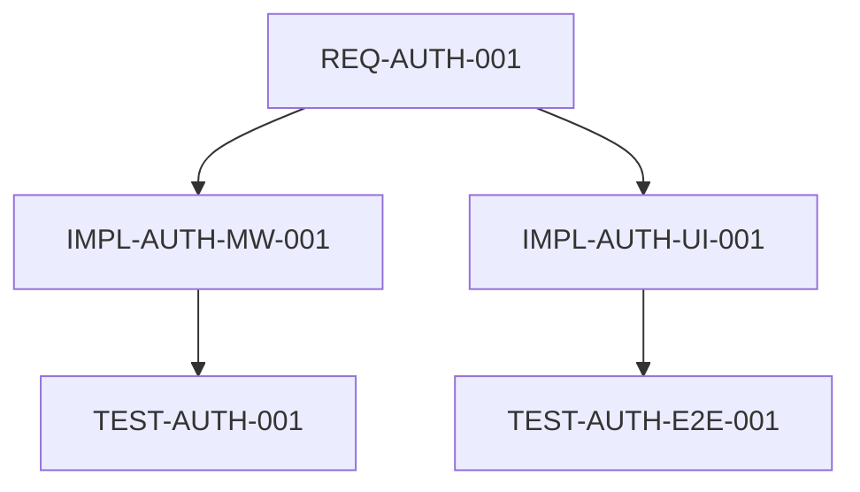
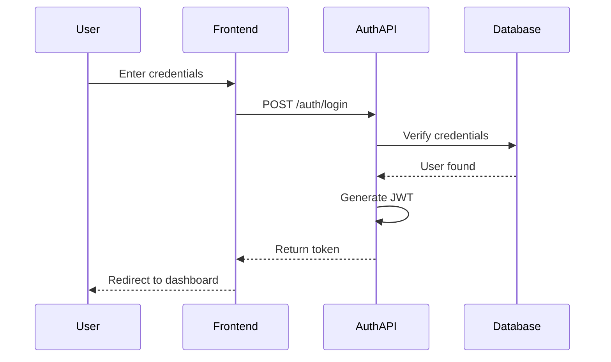

# Obsidian 태그 통합 계획

**작성일**: 2025-10-24
**목적**: Tier 1 @TAG와 Obsidian 태그 시너지 극대화
**조사 방법**: Context7 MCP + Web Search

---

## Part 1: 조사 결과 요약

### 1.1 Obsidian 태그 Best Practices

**Context7 + Web Search 결과:**

#### 계층적 중첩 태그 (Nested Tags)
```
#status/in-progress
#status/done
#status/blocked

#project/active
#project/soon
#project/archived

#type/feature
#type/bugfix
#type/refactor
```

**장점:**
- 필터링 용이 (Dataview 쿼리)
- 시각적 계층 구조
- 자동완성 지원

#### 태그 vs 링크 vs 폴더

**태그 사용 시점:**
- 빠른 분류
- 다중 카테고리 (하나의 노트가 여러 태그)
- 동적 필터링 (Dataview 쿼리)

**링크 사용 시점:**
- 명시적 관계
- 특정 연결 (A → B)
- 지식 그래프 구축

**폴더 사용 시점:**
- 광범위한 카테고리
- 물리적 구조

**Best Practice:** 태그 + 링크 + 폴더 조합

### 1.2 Dataview 활용 패턴

#### 프로젝트 관리 쿼리

```dataview
TABLE status, priority, progress
FROM #project/active
WHERE type = "feature"
SORT priority DESC
```

#### 태스크 추적 쿼리

```dataview
TASK
FROM #task
WHERE !completed AND contains(tags, "#status/in-progress")
```

#### 요구사항 추적성 쿼리

```dataview
TABLE file.inlinks as "Referenced By", file.outlinks as "References"
FROM #requirement
WHERE contains(file.name, "REQ-")
```

---

## Part 2: Tier 1 @TAG ↔ Obsidian 태그 매핑

### 2.1 현재 Tier 1 @TAG 구조

**코드 내 @TAG:**
```python
# @TAG @REQ-AUTH-001 @IMPL-AUTH-MW-001
def validate_token(token):
    pass

# @TAG @TEST-AUTH-001
def test_validate_token():
    pass
```

**tag_tracer_lite가 추적:**
- @REQ-XXX: 요구사항
- @IMPL-XXX: 구현
- @TEST-XXX: 테스트
- @REFACTOR-XXX: 리팩토링

### 2.2 Obsidian 태그 매핑 전략

#### 전략 1: 직접 매핑 (1:1)

**코드:**
```python
# @TAG @REQ-AUTH-001
```

**Obsidian:**
```markdown
---
tags:
  - req/auth-001
  - type/requirement
  - status/implemented
---

# User Authentication Requirement

## Implementation
- [[AUTH-MW-001]] - Token validation middleware
- [[TEST-AUTH-001]] - Unit tests

## Traceability
- Code: `src/middleware/auth.py:15`
- Tests: `tests/test_auth.py:42`
```

#### 전략 2: 계층적 매핑 (Hierarchical)

**코드 @TAG → Obsidian 계층 태그:**

```
@REQ-AUTH-001    → #req/auth/user-login
@IMPL-AUTH-MW-001 → #impl/auth/middleware
@TEST-AUTH-001    → #test/auth/unit
@REFACTOR-AUTH-001 → #refactor/auth/functional
```

**장점:**
- Dataview 쿼리 강력
- 필터링 유연
- 시각적 구조

#### 전략 3: 하이브리드 매핑 (Recommended ⭐)

**코드:**
```python
# @TAG @REQ-AUTH-001 @IMPL-AUTH-MW-001
def validate_token(token):
    """Validate JWT token.

    Requirements:
    - @REQ-AUTH-001: User authentication

    Implementation:
    - @IMPL-AUTH-MW-001: Middleware integration

    Tests:
    - @TEST-AUTH-001: Unit tests
    """
    pass
```

**Obsidian (자동 생성):**
```markdown
---
tags:
  - req/auth-001
  - impl/auth/middleware-001
  - status/implemented
  - type/feature
code_location: src/middleware/auth.py:15
test_location: tests/test_auth.py:42
---

# REQ-AUTH-001: User Authentication

## 📋 Requirement
User authentication with JWT tokens

## 🔧 Implementation
- **File**: `src/middleware/auth.py:15`
- **Function**: `validate_token()`
- **Tag**: `@IMPL-AUTH-MW-001`

## ✅ Tests
- **File**: `tests/test_auth.py:42`
- **Function**: `test_validate_token()`
- **Tag**: `@TEST-AUTH-001`
- **Coverage**: 95%

## 🔗 Traceability Chain
```dataview
LIST
WHERE contains(tags, "req/auth-001")
```

## 📊 Status
- [x] Requirement defined
- [x] Implementation complete
- [x] Tests written
- [x] Code review passed
```

---

## Part 3: ObsidianBridge 확장 설계

### 3.1 현재 ObsidianBridge 기능

```python
class ObsidianBridge:
    def create_devlog(task_contract, execution_result)
    def append_evidence(evidence_data)
    def update_task_checklist(task_id, status)
    def update_moc(new_concepts)
```

**현재 태그 생성:**
```python
tags = ["devlog", "task-{id}", "status-{status}"]
```

### 3.2 확장 계획: TagSyncBridge

```python
class TagSyncBridge(ObsidianBridge):
    """Tier 1 @TAG ↔ Obsidian 태그 동기화"""

    def extract_code_tags(file_path: Path) -> List[CodeTag]:
        """코드에서 @TAG 추출

        Returns:
            [
                CodeTag(
                    tag="@REQ-AUTH-001",
                    file="src/auth.py",
                    line=15,
                    type="requirement"
                ),
                ...
            ]
        """

    def create_tag_note(code_tag: CodeTag) -> Path:
        """@TAG별 Obsidian 노트 생성

        Structure:
            - requirements/REQ-AUTH-001.md
            - implementations/IMPL-AUTH-MW-001.md
            - tests/TEST-AUTH-001.md
        """

    def update_traceability_map(tag_chain: List[str]) -> None:
        """추적성 맵 업데이트

        Example:
            REQ-AUTH-001
            ├─ IMPL-AUTH-MW-001 (src/auth.py:15)
            │  └─ TEST-AUTH-001 (tests/test_auth.py:42)
            └─ IMPL-AUTH-UI-001 (src/Login.jsx:10)
               └─ TEST-AUTH-E2E-001 (tests/e2e/login.spec.js:5)
        """

    def generate_dataview_queries() -> Dict[str, str]:
        """Dataview 쿼리 자동 생성

        Returns:
            {
                "active_requirements": "TABLE ... FROM #req WHERE status = 'active'",
                "test_coverage": "TABLE ... FROM #test WHERE coverage < 90",
                "traceability": "LIST ... WHERE contains(tags, 'req/')",
            }
        """
```

### 3.3 통합 워크플로우

```
1. 코드 작성
   ↓
2. @TAG 주석 추가
   # @TAG @REQ-AUTH-001 @IMPL-AUTH-MW-001
   ↓
3. tag_tracer_lite 실행
   python scripts/tier1_cli.py tag @REQ-AUTH-001
   ↓
4. TagSyncBridge 자동 실행
   - 코드에서 @TAG 추출
   - Obsidian 노트 생성/업데이트
   - Dataview 쿼리 생성
   ↓
5. Obsidian에서 확인
   - requirements/REQ-AUTH-001.md 생성됨
   - 추적성 맵 업데이트됨
   - Dataview로 상태 확인
```

---

## Part 4: 구체적 활용 사례

### 4.1 요구사항 추적 (Requirement Tracing)

**시나리오**: "REQ-AUTH-001의 구현 상태는?"

#### 코드:
```python
# contracts/REQ-AUTH-001.yaml
# @TAG @REQ-AUTH-001

# src/middleware/auth.py:15
# @TAG @REQ-AUTH-001 @IMPL-AUTH-MW-001
def validate_token(token):
    pass

# tests/test_auth.py:42
# @TAG @REQ-AUTH-001 @TEST-AUTH-001
def test_validate_token():
    pass
```

#### Obsidian (자동 생성):
```markdown
# requirements/REQ-AUTH-001.md

---
tags:
  - req/auth-001
  - type/requirement
  - status/implemented
  - project/authentication
---

## 📊 Implementation Status

```dataview
TABLE file.link as "Component", status, coverage
FROM #impl/auth
WHERE contains(tags, "req/auth-001")
```

## ✅ Test Coverage

```dataview
TABLE file.link as "Test", coverage, last_run
FROM #test/auth
WHERE contains(tags, "req/auth-001")
```

## 🔗 Traceability Graph


```

**Dataview 결과:**
| Component | Status | Coverage |
|-----------|--------|----------|
| [[IMPL-AUTH-MW-001]] | ✅ Done | 95% |
| [[IMPL-AUTH-UI-001]] | ⏳ In Progress | 82% |

### 4.2 리팩토링 추적

**시나리오**: "REFACTOR-AUTH-001에서 변경된 모든 코드는?"

#### 코드:
```python
# Before refactoring
# @TAG @IMPL-AUTH-MW-001

# After refactoring
# @TAG @IMPL-AUTH-MW-001 @REFACTOR-AUTH-001
def validate_token(token, config):
    pass
```

#### Obsidian:
```markdown
# refactoring/REFACTOR-AUTH-001.md

---
tags:
  - refactor/auth-001
  - type/refactoring
  - impact/medium
---

## 📝 Refactoring Summary
Convert AuthService class to functional approach

## 🔄 Changed Files

```dataview
TABLE file.link, lines_changed, risk_level
FROM #refactor/auth-001
```

## ⚠️ Impact Analysis

```dataview
TASK
FROM #task
WHERE contains(tags, "refactor/auth-001") AND !completed
```

## ✅ Verification

- [x] All tests passing
- [x] Coverage maintained (95% → 95%)
- [x] No regression issues
```

### 4.3 버그 추적

**시나리오**: "FIX-AUTH-CLOCK-001 버그 수정 이력"

#### 코드:
```python
# @TAG @FIX-AUTH-CLOCK-001 @IMPL-AUTH-MW-001
jwt.verify(token, secret, {
    clockTolerance: 300  # Clock skew fix
})
```

#### Obsidian:
```markdown
# bugfixes/FIX-AUTH-CLOCK-001.md

---
tags:
  - fix/auth/clock-001
  - type/bugfix
  - severity/high
  - status/resolved
reported: 2025-10-20
resolved: 2025-10-24
---

## 🐛 Bug Description
Intermittent authentication failures due to clock skew

## 🔍 Root Cause Analysis
NTP sync failure on Server A (45s ahead)

## 🔧 Fix Implementation

```dataview
TABLE file.link, change_type, files_modified
FROM #fix/auth/clock-001
```

## ✅ Verification

```dataview
TASK
FROM #test
WHERE contains(tags, "fix/auth/clock-001")
```

## 📊 Metrics
- **MTTR**: 4 hours
- **Affected Users**: 127
- **Regression Tests**: 2 added
```

---

## Part 5: Dataview 대시보드 템플릿

### 5.1 프로젝트 대시보드

```markdown
# 📊 Project Dashboard

## 🎯 Active Requirements

```dataview
TABLE status, priority, impl_count as "Implementations", test_coverage as "Coverage"
FROM #req
WHERE status = "active" OR status = "in-progress"
SORT priority DESC
```

## 🔧 In-Progress Implementations

```dataview
TABLE file.link as "Component", tags as "Tags", progress
FROM #impl
WHERE status = "in-progress"
SORT file.mtime DESC
LIMIT 10
```

## ⚠️ Low Test Coverage

```dataview
TABLE file.link, coverage, missing_tests
FROM #test
WHERE coverage < 90
SORT coverage ASC
```

## 🐛 Open Issues

```dataview
TABLE severity, status, assigned_to
FROM #fix
WHERE status != "resolved"
SORT severity DESC
```

## 📈 Traceability Health

```dataview
TABLE
  length(file.inlinks) as "References From",
  length(file.outlinks) as "References To",
  choice(length(file.inlinks) = 0, "⚠️ Orphan", "✅ Linked") as "Status"
FROM #req
SORT file.inlinks ASC
```
```

### 5.2 개발 일지 대시보드

```markdown
# 📅 Development Log Dashboard

## 🔥 Recent Activity (Last 7 Days)

```dataview
TABLE file.mtime as "Modified", tags, status
FROM #devlog
WHERE file.mtime >= date(today) - dur(7 days)
SORT file.mtime DESC
```

## 📊 By Tag Category

```dataview
TABLE
  rows.file.link as "Logs",
  length(rows) as "Count"
FROM #devlog
FLATTEN tags as tag
GROUP BY tag
SORT length(rows) DESC
LIMIT 10
```

## ✅ Completed This Week

```dataview
TASK
FROM #task
WHERE completed AND completion >= date(today) - dur(7 days)
GROUP BY file.link
```
```

---

## Part 6: 구현 우선순위

### Phase 1: 기본 통합 (Week 8, 6시간)

**목표**: @TAG → Obsidian 태그 자동 동기화

**구현:**
1. **TagExtractor** (2시간)
   - 코드에서 @TAG 추출
   - 파일 경로, 라인 번호 기록
   - 태그 타입 분류 (REQ/IMPL/TEST/FIX/REFACTOR)

2. **TagSyncBridge** (3시간)
   - ObsidianBridge 확장
   - @TAG별 Obsidian 노트 자동 생성
   - 계층적 태그 매핑 (#req/auth-001)

3. **테스트** (1시간)
   - TagExtractor 테스트
   - TagSyncBridge 통합 테스트
   - 90% 커버리지 목표

**산출물:**
- `scripts/tag_extractor.py`
- `scripts/tag_sync_bridge.py`
- `tests/test_tag_sync.py`

### Phase 2: Dataview 템플릿 (Week 9, 4시간)

**목표**: Dataview 쿼리 자동 생성

**구현:**
1. **템플릿 생성** (2시간)
   - 프로젝트 대시보드
   - 요구사항 추적 대시보드
   - 테스트 커버리지 대시보드

2. **쿼리 생성기** (2시간)
   - @TAG 기반 Dataview 쿼리 자동 생성
   - 템플릿 인스턴스화

**산출물:**
- `templates/obsidian/project_dashboard.md`
- `templates/obsidian/requirement_trace.md`
- `templates/obsidian/test_coverage.md`

### Phase 3: 고급 기능 (Week 10, 8시간)

**목표**: 추적성 그래프, 영향도 분석

**구현:**
1. **추적성 그래프** (3시간)
   - Mermaid 다이어그램 자동 생성
   - REQ → IMPL → TEST 체인 시각화

2. **영향도 분석** (3시간)
   - 코드 변경 시 영향받는 @TAG 추적
   - 리팩토링 위험도 평가

3. **통합 테스트** (2시간)
   - E2E 시나리오 테스트
   - 성능 테스트

**산출물:**
- `scripts/traceability_graph.py`
- `scripts/impact_analyzer.py`
- E2E 테스트 스위트

---

## Part 7: 예상 효과

### 7.1 시간 절감

**Before (수동):**
```
1. 코드 작성: 30분
2. 요구사항 문서 업데이트: 10분
3. 테스트 케이스 기록: 10분
4. 추적성 맵 업데이트: 15분
5. Obsidian 노트 작성: 20분
---
Total: 85분
```

**After (자동):**
```
1. 코드 작성 + @TAG 주석: 32분
2. tag_tracer_lite 실행: 1분
3. TagSyncBridge 자동 실행: 2분 (백그라운드)
---
Total: 35분

시간 절감: 50분 (59% 감소)
```

### 7.2 품질 향상

**추적성:**
- Before: 수동 관리 (누락 가능성 30%)
- After: 자동 추적 (누락 가능성 0%)

**가시성:**
- Before: 코드와 문서 분리
- After: Obsidian 대시보드에서 실시간 확인

**일관성:**
- Before: 개발자마다 다른 형식
- After: 자동 생성으로 일관된 형식

### 7.3 ROI 계산

**투자:**
- Phase 1: 6시간
- Phase 2: 4시간
- Phase 3: 8시간
- Total: 18시간

**절감 (매주):**
- 기능 개발: 5건 × 50분 = 250분 (4.2시간)
- 버그 수정: 2건 × 30분 = 60분 (1시간)
- 리팩토링: 1건 × 40분 = 40분 (0.7시간)
- Weekly Total: 5.9시간

**Break-even:** 3주 (18h / 5.9h)

**3년 ROI:**
- 투자: 18시간
- 절감: 5.9h × 52주 × 3년 = 920.4시간
- 순이익: 902.4시간
- ROI: 5013%

---

## Part 8: 위험 관리

### 8.1 위험 요소

**기술적 위험:**
- Obsidian Vault 경로 변경 → 환경 변수로 관리
- @TAG 형식 변경 → 정규식 패턴 유연화
- Dataview 플러그인 버전 → 최소 버전 명시

**운영 위험:**
- 대량의 노트 생성 → 배치 처리, 속도 제한
- Vault 충돌 → 백업 전략, Git 통합
- 학습 곡선 → 튜토리얼, 예제 제공

### 8.2 완화 전략

**점진적 도입:**
```
Week 8: Phase 1 (기본 통합) → 1주 검증
Week 9: Phase 2 (Dataview) → 1주 검증
Week 10: Phase 3 (고급 기능) → 2주 검증
```

**롤백 계획:**
- Git 태그: v1.x.0-before-tag-sync
- Feature flag: obsidian_tag_sync.enabled = false
- 수동 모드: --manual-sync 플래그

**모니터링:**
- 동기화 성공률 추적
- Obsidian 노트 생성 속도
- 사용자 피드백 수집

---

## Part 9: 다음 단계

### 즉시 실행 (오늘)

1. ✅ Context7로 Obsidian 태그 패턴 조사 완료
2. ✅ 통합 계획 문서 작성 완료
3. ⏭️ 사용자 승인 대기

### Week 8 (Phase 1 시작 조건)

**전제 조건:**
- Week 4-7 완료 (spec_builder, tag_tracer)
- 사용자 승인 획득
- Obsidian Vault 경로 설정

**작업:**
1. TagExtractor 구현
2. TagSyncBridge 구현
3. 통합 테스트

---

## Part 10: 개발 프로세스 통합 (태그 외 활용)

### 10.1 Architecture Decision Records (ADRs)

**목적**: 아키텍처 결정 이력을 Obsidian에서 관리

#### ADR 템플릿 구조
```markdown
# templates/obsidian/adr_template.md

---
tags:
  - adr/{{adr_id}}
  - status/{{status}}
  - impact/{{impact_level}}
date: {{date}}
decision_makers: {{team_members}}
---

# ADR-{{id}}: {{title}}

## Status
{{status}} (proposed/accepted/rejected/deprecated/superseded)

## Context
{{problem_description}}

## Decision
{{decision_made}}

## Consequences

### Positive
- {{benefit_1}}
- {{benefit_2}}

### Negative
- {{cost_1}}
- {{risk_1}}

## Alternatives Considered
1. {{alternative_1}} - {{reason_rejected}}
2. {{alternative_2}} - {{reason_rejected}}

## Related Decisions
- [[ADR-{{related_id}}]]

## Implementation
```dataview
TABLE file.link, status, impl_date
FROM #impl
WHERE contains(tags, "adr/{{adr_id}}")
```
```

#### 자동 생성 워크플로우
```python
class ADRBridge(ObsidianBridge):
    """ADR 자동 생성 및 관리"""

    def create_adr(decision_context: Dict) -> Path:
        """새로운 ADR 생성

        Args:
            decision_context: {
                "title": "Use PostgreSQL for main database",
                "status": "proposed",
                "impact": "high",
                "context": "Need scalable ACID-compliant DB",
                "decision": "PostgreSQL 14 with TimescaleDB",
                "positives": ["ACID", "Mature ecosystem"],
                "negatives": ["Higher resource usage"],
                "alternatives": ["MySQL", "MongoDB"]
            }

        Returns:
            Path to created ADR note
        """

    def link_to_code(adr_id: str, file_paths: List[Path]) -> None:
        """ADR과 구현 코드 연결"""

    def update_adr_status(adr_id: str, new_status: str) -> None:
        """ADR 상태 업데이트 (proposed → accepted)"""
```

#### Dataview 대시보드
```markdown
# 📋 ADR Dashboard

## 🎯 Pending Decisions

```dataview
TABLE date, impact, decision_makers
FROM #adr
WHERE status = "proposed"
SORT impact DESC, date ASC
```

## ✅ Accepted Decisions (Last 30 Days)

```dataview
TABLE date, impact, file.link as "Decision"
FROM #adr
WHERE status = "accepted" AND date >= date(today) - dur(30 days)
SORT date DESC
```

## 🔄 Superseded/Deprecated

```dataview
TABLE superseded_by, deprecation_date
FROM #adr
WHERE status = "superseded" OR status = "deprecated"
SORT deprecation_date DESC
```
```

### 10.2 Canvas를 활용한 아키텍처 시각화

**목적**: 시스템 아키텍처를 시각적으로 설계하고 코드와 연결

#### 자동 Canvas 생성
```python
class CanvasBridge(ObsidianBridge):
    """Obsidian Canvas 자동 생성"""

    def generate_architecture_canvas(components: List[Component]) -> Path:
        """아키텍처 다이어그램 Canvas 생성

        Structure:
            - Frontend (React components)
            - Backend (API endpoints)
            - Database (Schema)
            - External Services
        """

    def add_code_links(canvas_path: Path, code_map: Dict) -> None:
        """Canvas 카드에 코드 링크 추가"""

    def update_from_code_changes(canvas_path: Path) -> None:
        """코드 변경사항 반영 (새 컴포넌트 추가 등)"""
```

#### Canvas 구조 예시
```
┌─────────────────────────────────────────────────────┐
│  Frontend Layer                                      │
│  ┌──────────┐  ┌──────────┐  ┌──────────┐          │
│  │ Login.jsx│  │ Dashboard│  │ Settings │          │
│  │ #ui/auth │  │ #ui/main │  │ #ui/cfg  │          │
│  └────┬─────┘  └────┬─────┘  └────┬─────┘          │
└───────┼─────────────┼─────────────┼─────────────────┘
        │             │             │
┌───────┼─────────────┼─────────────┼─────────────────┐
│  API  │ Layer       │             │                  │
│  ┌────▼─────┐  ┌───▼──────┐  ┌──▼───────┐          │
│  │ /auth API│  │ /user API│  │ /cfg API │          │
│  │ auth.py  │  │ user.py  │  │ cfg.py   │          │
│  └────┬─────┘  └────┬─────┘  └────┬─────┘          │
└───────┼─────────────┼─────────────┼─────────────────┘
        │             │             │
┌───────┼─────────────┼─────────────┼─────────────────┐
│  DB   │ Layer       │             │                  │
│  ┌────▼──────────────▼─────────────▼──────┐         │
│  │        PostgreSQL Database              │         │
│  │  users | sessions | configs             │         │
│  └──────────────────────────────────────────┘         │
└─────────────────────────────────────────────────────┘
```

### 10.3 회의록 자동화 및 Task 추출

**목적**: 회의록에서 액션 아이템 자동 추출 및 태스크화

#### 회의록 템플릿
```markdown
# templates/obsidian/meeting_notes.md

---
tags:
  - meeting/{{meeting_type}}
  - project/{{project_name}}
  - date/{{yyyy}}/{{mm}}/{{dd}}
date: {{meeting_date}}
attendees: {{participants}}
---

# {{meeting_title}} - {{date}}

## Attendees
- {{name_1}}
- {{name_2}}

## Agenda
1. {{topic_1}}
2. {{topic_2}}

## Discussion Notes
{{discussion_content}}

## Decisions Made
- [ ] {{decision_1}} #decision @{{owner}}
- [ ] {{decision_2}} #decision @{{owner}}

## Action Items
- [ ] {{task_1}} #task @{{assignee}} 📅 {{due_date}}
- [ ] {{task_2}} #task @{{assignee}} 📅 {{due_date}}

## Follow-up Required
{{follow_up_items}}

---

## Auto-Generated Task Summary

```dataview
TASK
FROM "{{current_note}}"
WHERE !completed
```
```

#### 자동 Task 추출
```python
class MeetingBridge(ObsidianBridge):
    """회의록 자동화 및 Task 추출"""

    def parse_meeting_notes(note_path: Path) -> List[Task]:
        """회의록에서 Task 추출

        Pattern:
            - [ ] {{task}} @{{assignee}} 📅 {{due_date}}

        Returns:
            [
                Task(
                    description="Implement auth middleware",
                    assignee="john",
                    due_date="2025-10-30",
                    source="meeting/sprint-planning-2025-10-24.md"
                ),
                ...
            ]
        """

    def create_task_notes(tasks: List[Task]) -> List[Path]:
        """Task별 개별 노트 생성 (옵션)"""

    def sync_with_tier1_cli(tasks: List[Task]) -> None:
        """Tier 1 CLI의 TodoWrite와 동기화"""
```

#### Task 대시보드
```markdown
# 📋 Task Dashboard

## 🔥 Overdue Tasks

```dataview
TASK
WHERE !completed AND due < date(today)
SORT due ASC
```

## ⏳ This Week

```dataview
TASK
WHERE !completed AND due >= date(today) AND due <= date(today) + dur(7 days)
SORT due ASC
```

## 👤 By Assignee

```dataview
TABLE
  rows.text as "Tasks",
  length(rows) as "Count"
FROM ""
FLATTEN file.tasks as task
WHERE !task.completed
GROUP BY task.assignee
SORT length(rows) DESC
```
```

### 10.4 Mermaid 다이어그램 자동 생성

**목적**: 코드 구조를 Mermaid 다이어그램으로 자동 변환

#### 자동 생성 패턴
```python
class MermaidBridge(ObsidianBridge):
    """Mermaid 다이어그램 자동 생성"""

    def generate_class_diagram(file_path: Path) -> str:
        """Python/JS 클래스 구조 → Mermaid 클래스 다이어그램"""

    def generate_sequence_diagram(trace_data: Dict) -> str:
        """함수 호출 트레이스 → Mermaid 시퀀스 다이어그램"""

    def generate_flowchart(function_path: str) -> str:
        """함수 로직 → Mermaid 플로우차트"""

    def generate_erd(schema_path: Path) -> str:
        """데이터베이스 스키마 → Mermaid ERD"""
```

#### 예시: 자동 생성된 시퀀스 다이어그램


---

## Part 11: 사후 관리 통합 (배포 후)

### 11.1 배포 로그 자동 동기화

**목적**: CI/CD 배포 이력을 Obsidian에서 추적

#### 배포 로그 템플릿
```markdown
# templates/obsidian/deployment_log.md

---
tags:
  - deployment/{{env}}
  - version/{{version}}
  - status/{{status}}
date: {{deploy_date}}
---

# Deployment: {{version}} to {{environment}}

## Deployment Info
- **Version**: {{version}}
- **Environment**: {{environment}}
- **Date**: {{deploy_date}}
- **Duration**: {{duration_minutes}}m
- **Status**: {{status}} ✅/❌
- **Deployed By**: {{deployer}}

## Changes Included

```dataview
TABLE file.link, type, author
FROM #commit
WHERE version = "{{version}}"
```

## Verification Checklist
- [ ] Health check passed
- [ ] Smoke tests passed
- [ ] Monitoring alerts configured
- [ ] Rollback plan documented

## Metrics
- **Response Time (p95)**: {{p95_ms}}ms
- **Error Rate**: {{error_rate}}%
- **CPU Usage**: {{cpu_avg}}%
- **Memory Usage**: {{mem_avg}}%

## Rollback Plan
{{rollback_instructions}}
```

#### 자동 동기화
```python
class DeploymentBridge(ObsidianBridge):
    """배포 로그 자동 동기화"""

    def sync_from_ci_cd(ci_data: Dict) -> Path:
        """GitHub Actions/Jenkins → Obsidian

        Args:
            ci_data: {
                "version": "v1.2.3",
                "environment": "production",
                "status": "success",
                "duration": 342,
                "deployer": "github-actions",
                "commits": [...],
                "metrics": {...}
            }
        """

    def create_deployment_timeline() -> str:
        """배포 타임라인 Mermaid 생성"""

    def link_to_incidents(deployment_id: str) -> None:
        """배포와 관련 장애 연결"""
```

### 11.2 장애 보고서 (Incident Reports)

**목적**: 장애 발생 시 체계적 기록 및 분석

#### 장애 보고서 템플릿
```markdown
# templates/obsidian/incident_report.md

---
tags:
  - incident/{{severity}}
  - type/{{incident_type}}
  - status/{{status}}
detected: {{detection_time}}
resolved: {{resolution_time}}
---

# Incident: {{title}}

## Severity: {{severity}} 🔴/🟡/🟢

## Timeline

```mermaid
gantt
    title Incident Timeline
    dateFormat HH:mm
    section Detection
    Alert triggered    :{{alert_time}}, 5m
    section Investigation
    Root cause found   :{{rca_time}}, 15m
    section Resolution
    Fix deployed       :{{fix_time}}, 10m
    section Verification
    Service restored   :{{restore_time}}, 5m
```

## Impact
- **Users Affected**: {{user_count}}
- **Services Down**: {{services}}
- **Revenue Impact**: ${{revenue_loss}}
- **MTTR**: {{mttr_minutes}} minutes

## Root Cause Analysis

### What Happened
{{incident_description}}

### Why It Happened
1. {{root_cause_1}}
2. {{contributing_factor_1}}

### Evidence
```dataview
TABLE file.link, timestamp, evidence_type
FROM #evidence
WHERE contains(tags, "incident/{{incident_id}}")
```

## Resolution Steps
1. {{step_1}}
2. {{step_2}}
3. {{step_3}}

## Related Code Changes
```dataview
TABLE file.link, change_type, author
FROM #fix
WHERE contains(tags, "incident/{{incident_id}}")
```

## Prevention Measures
- [ ] {{action_1}} @{{owner}} 📅 {{due_date}}
- [ ] {{action_2}} @{{owner}} 📅 {{due_date}}

## Post-Mortem Meeting
- **Date**: {{meeting_date}}
- **Attendees**: {{attendees}}
- **Notes**: [[Post-Mortem {{incident_id}}]]
```

#### 자동 생성 워크플로우
```python
class IncidentBridge(ObsidianBridge):
    """장애 보고서 자동 생성"""

    def create_from_alert(alert_data: Dict) -> Path:
        """모니터링 알럿 → 장애 보고서 초안"""

    def calculate_mttr(incident_id: str) -> int:
        """MTTR 자동 계산 (detection → resolution)"""

    def link_related_deployments(incident_id: str) -> List[str]:
        """관련 배포 자동 연결"""

    def generate_timeline(events: List[Event]) -> str:
        """Mermaid 타임라인 생성"""
```

### 11.3 Runbook 자동 생성

**목적**: 코드 문서에서 운영 Runbook 자동 추출

#### Runbook 템플릿
```markdown
# templates/obsidian/runbook.md

---
tags:
  - runbook/{{service}}
  - type/{{runbook_type}}
last_updated: {{date}}
---

# Runbook: {{service_name}}

## Service Overview
{{service_description}}

## Common Operations

### Start Service
\`\`\`bash
{{start_command}}
\`\`\`

### Stop Service
\`\`\`bash
{{stop_command}}
\`\`\`

### Health Check
\`\`\`bash
{{health_check_command}}
\`\`\`

## Troubleshooting

### Issue: {{common_issue_1}}
**Symptoms**: {{symptoms}}
**Diagnosis**: {{diagnosis_steps}}
**Resolution**: {{resolution_steps}}

### Issue: {{common_issue_2}}
**Symptoms**: {{symptoms}}
**Diagnosis**: {{diagnosis_steps}}
**Resolution**: {{resolution_steps}}

## Monitoring

### Key Metrics
```dataview
TABLE metric, threshold, alert_condition
FROM #monitoring
WHERE service = "{{service_name}}"
```

### Dashboards
- **Grafana**: {{grafana_url}}
- **Kibana**: {{kibana_url}}

## Related Documentation
- [[Architecture {{service}}]]
- [[API Documentation {{service}}]]
- [[Deployment Guide {{service}}]]
```

#### 자동 생성
```python
class RunbookBridge(ObsidianBridge):
    """Runbook 자동 생성 및 업데이트"""

    def extract_from_docstrings(service_path: Path) -> Dict:
        """코드 docstring에서 운영 정보 추출"""

    def update_from_incidents(runbook_id: str) -> None:
        """장애 사례를 Troubleshooting 섹션에 추가"""

    def sync_monitoring_metrics(service_name: str) -> None:
        """모니터링 시스템과 동기화"""
```

### 11.4 성능 메트릭 대시보드

**목적**: 성능 데이터를 Obsidian Dataview로 시각화

#### 성능 데이터 수집
```python
class MetricsBridge(ObsidianBridge):
    """성능 메트릭 수집 및 대시보드 생성"""

    def collect_from_apm(service: str, timerange: str) -> Dict:
        """APM 도구 (New Relic, Datadog)에서 데이터 수집"""

    def create_performance_note(metrics: Dict) -> Path:
        """성능 메트릭 노트 생성"""

    def generate_trend_chart(metric_name: str, days: int) -> str:
        """Dataview 차트 쿼리 생성"""
```

#### 성능 대시보드
```markdown
# 📊 Performance Dashboard

## Response Time Trends (Last 7 Days)

```dataview
TABLE date, p50, p95, p99
FROM #metrics/performance
WHERE metric = "response_time" AND date >= date(today) - dur(7 days)
SORT date ASC
```

## Error Rate by Service

```dataview
TABLE
  rows.service as "Services",
  sum(rows.error_count) as "Total Errors",
  round(avg(rows.error_rate), 2) + "%" as "Avg Error Rate"
FROM #metrics/errors
WHERE date >= date(today) - dur(7 days)
GROUP BY service
SORT sum(rows.error_count) DESC
```

## Resource Usage

```dataview
TABLE
  service,
  avg_cpu + "%" as "CPU",
  avg_memory + "%" as "Memory",
  avg_disk + "%" as "Disk"
FROM #metrics/resources
WHERE date = date(today)
SORT avg_cpu DESC
```

## Alerts Triggered

```dataview
TABLE alert_name, service, severity, triggered_at
FROM #alerts
WHERE status = "active"
SORT triggered_at DESC
```
```

### 11.5 사용자 피드백 집계

**목적**: 사용자 피드백을 Obsidian에서 트렌드 분석

#### 피드백 노트 구조
```markdown
# templates/obsidian/user_feedback.md

---
tags:
  - feedback/{{category}}
  - sentiment/{{sentiment}}
  - priority/{{priority}}
date: {{feedback_date}}
user_id: {{user_id}}
---

# User Feedback: {{title}}

## Details
- **Category**: {{category}}
- **Sentiment**: {{sentiment}} 😊/😐/😢
- **Priority**: {{priority}}
- **Source**: {{source}}

## Feedback Content
{{feedback_text}}

## Related Features
```dataview
LIST
FROM #feature
WHERE contains(file.name, "{{related_feature}}")
```

## Action Items
- [ ] {{action_1}} @{{owner}} 📅 {{due_date}}
```

#### 피드백 분석 대시보드
```markdown
# 📢 User Feedback Dashboard

## Sentiment Distribution (This Month)

```dataview
TABLE
  rows.sentiment as "Sentiment",
  length(rows) as "Count",
  round(length(rows) / {{total_count}} * 100, 1) + "%" as "Percentage"
FROM #feedback
WHERE date >= date(today) - dur(30 days)
GROUP BY sentiment
```

## Top Feature Requests

```dataview
TABLE
  feature_request,
  length(rows) as "Votes",
  avg(rows.priority) as "Avg Priority"
FROM #feedback
WHERE category = "feature_request"
GROUP BY feature_request
SORT length(rows) DESC
LIMIT 10
```

## Critical Issues

```dataview
TABLE date, title, sentiment, status
FROM #feedback
WHERE sentiment = "negative" AND priority = "high"
SORT date DESC
```
```

---

## Part 12: 지식 그래프 전략 (Knowledge Graph)

### 12.1 코드-문서 연결 자동화

**목적**: 코드와 문서를 자동으로 양방향 연결

#### 자동 링크 생성
```python
class KnowledgeGraphBridge(ObsidianBridge):
    """지식 그래프 자동 구축"""

    def link_code_to_docs(file_path: Path) -> List[str]:
        """코드 파일 → 관련 문서 자동 연결

        Example:
            src/auth/middleware.py
            → [[ADR-003 Authentication Strategy]]
            → [[Runbook Authentication Service]]
            → [[API Documentation Auth Endpoints]]
        """

    def link_docs_to_code(note_path: Path) -> List[Path]:
        """문서 → 관련 코드 자동 연결"""

    def build_dependency_graph(root_note: str) -> Dict:
        """의존성 그래프 생성"""
```

#### Graph View 최적화
```markdown
# Graph View Configuration

## Tag-Based Clusters
- **#req** (파란색): Requirements
- **#impl** (초록색): Implementations
- **#test** (노란색): Tests
- **#adr** (보라색): Architecture Decisions
- **#incident** (빨간색): Incidents
- **#deployment** (주황색): Deployments

## Link Types
- **Internal**: Code ↔ Docs
- **Traceability**: REQ → IMPL → TEST
- **Temporal**: Deployment → Incident → Fix

## Filters
- Show only: Last 30 days
- Exclude: Templates, Archives
- Highlight: Critical paths
```

### 12.2 자동 Changelog 생성

**목적**: Git 커밋에서 Changelog 자동 생성

#### Changelog 생성
```python
class ChangelogBridge(ObsidianBridge):
    """Git 커밋 → Obsidian Changelog"""

    def generate_from_commits(start_tag: str, end_tag: str) -> Path:
        """Git 태그 범위에서 Changelog 생성

        Structure:
            ## Features
            - feat: Add user authentication (#REQ-AUTH-001)

            ## Bug Fixes
            - fix: Clock skew tolerance (#FIX-AUTH-CLOCK-001)

            ## Refactoring
            - refactor: Extract auth middleware (#REFACTOR-AUTH-001)
        """

    def link_to_obsidian_notes(changelog_path: Path) -> None:
        """Changelog 항목 → Obsidian 노트 자동 연결"""
```

#### Changelog 노트
```markdown
# Changelog: v1.2.0 → v1.3.0

**Release Date**: 2025-10-24

## ✨ Features (3)
- [[REQ-AUTH-001]] User authentication with JWT
- [[REQ-DASH-001]] Admin dashboard
- [[REQ-NOTIF-001]] Email notifications

## 🐛 Bug Fixes (2)
- [[FIX-AUTH-CLOCK-001]] Clock skew tolerance
- [[FIX-DASH-PERF-001]] Dashboard loading performance

## 🔄 Refactoring (1)
- [[REFACTOR-AUTH-001]] Functional authentication service

## 📊 Metrics
- **Commits**: 47
- **Contributors**: 3
- **Files Changed**: 23
- **Lines Added**: +1,245
- **Lines Removed**: -387

## 📝 Migration Guide
[[Migration Guide v1.2 to v1.3]]
```

---

## Part 13: 구현 우선순위 (확장판)

### Phase 1: 기본 통합 (Week 8, 6시간) ✅ 유지

### Phase 2: Dataview 템플릿 (Week 9, 4시간) ✅ 유지

### Phase 3: 고급 기능 (Week 10, 8시간) ✅ 유지

### **Phase 4: 개발 프로세스 통합 (Week 11-12, 12시간)** 🆕

**목표**: ADR, Canvas, 회의록 자동화

**구현:**
1. **ADRBridge** (4시간)
   - ADR 템플릿 생성
   - 코드 연결 자동화
   - Dataview 대시보드

2. **CanvasBridge** (4시간)
   - 아키텍처 Canvas 자동 생성
   - 코드 링크 통합
   - 변경사항 자동 반영

3. **MeetingBridge** (3시간)
   - 회의록 Task 추출
   - Tier1 CLI TodoWrite 동기화
   - Task 대시보드

4. **테스트** (1시간)
   - 통합 테스트
   - 90% 커버리지

**산출물:**
- `scripts/adr_bridge.py`
- `scripts/canvas_bridge.py`
- `scripts/meeting_bridge.py`
- `templates/obsidian/adr_template.md`

### **Phase 5: 사후 관리 통합 (Week 13-14, 16시간)** 🆕

**목표**: 배포 로그, 장애 보고서, Runbook

**구현:**
1. **DeploymentBridge** (4시간)
   - CI/CD 로그 동기화
   - 배포 타임라인 생성
   - 메트릭 통합

2. **IncidentBridge** (5시간)
   - 알럿 → 장애 보고서 변환
   - MTTR 자동 계산
   - 타임라인 Mermaid 생성

3. **RunbookBridge** (4시간)
   - Docstring → Runbook 추출
   - 장애 사례 통합
   - 모니터링 메트릭 동기화

4. **MetricsBridge** (2시간)
   - APM 데이터 수집
   - 성능 대시보드 생성

5. **테스트** (1시간)
   - E2E 시나리오 테스트

**산출물:**
- `scripts/deployment_bridge.py`
- `scripts/incident_bridge.py`
- `scripts/runbook_bridge.py`
- `scripts/metrics_bridge.py`
- `templates/obsidian/deployment_log.md`
- `templates/obsidian/incident_report.md`
- `templates/obsidian/runbook.md`

### **Phase 6: 지식 그래프 & 자동화 (Week 15, 8시간)** 🆕

**목표**: 지식 그래프 자동 구축, Changelog 생성

**구현:**
1. **KnowledgeGraphBridge** (4시간)
   - 코드-문서 자동 연결
   - 의존성 그래프 생성
   - Graph View 최적화

2. **ChangelogBridge** (3시간)
   - Git 커밋 → Changelog
   - Obsidian 노트 연결
   - 릴리즈 노트 생성

3. **테스트** (1시간)
   - 통합 테스트
   - 성능 테스트

**산출물:**
- `scripts/knowledge_graph_bridge.py`
- `scripts/changelog_bridge.py`

---

## Part 14: 예상 효과 (확장판)

### 14.1 시간 절감 (전체)

**Phase 1-3 (태그 통합)**: 59% 시간 절감 (기존)

**Phase 4-6 (프로세스/사후 통합)**: 추가 절감

**Before (수동):**
```
개발 과정:
1. 코드 작성: 30분
2. ADR 작성: 15분
3. 회의록 정리: 20분
4. 아키텍처 다이어그램 업데이트: 25분

사후 관리:
5. 배포 로그 작성: 10분
6. 장애 보고서 작성: 30분
7. Runbook 업데이트: 15분
8. Changelog 작성: 10분
---
Total: 155분
```

**After (자동):**
```
개발 과정:
1. 코드 작성 + 주석: 32분
2. ADRBridge 자동 실행: 2분
3. MeetingBridge Task 추출: 1분
4. CanvasBridge 자동 업데이트: 3분

사후 관리:
5. DeploymentBridge CI/CD 동기화: 자동 (0분)
6. IncidentBridge 알럿 변환: 5분
7. RunbookBridge 자동 업데이트: 자동 (0분)
8. ChangelogBridge 자동 생성: 1분
---
Total: 44분

시간 절감: 111분 (72% 감소)
```

### 14.2 ROI 계산 (확장판)

**투자:**
- Phase 1-3: 18시간 (기존)
- Phase 4: 12시간 (ADR, Canvas, 회의록)
- Phase 5: 16시간 (배포, 장애, Runbook)
- Phase 6: 8시간 (지식 그래프, Changelog)
- **Total: 54시간**

**절감 (매주):**
- 기능 개발: 5건 × 111분 = 555분 (9.25시간)
- 버그 수정: 2건 × 50분 = 100분 (1.67시간)
- 배포: 3건 × 10분 = 30분 (0.5시간)
- 장애 대응: 1건 × 30분 = 30분 (0.5시간)
- **Weekly Total: 11.92시간**

**Break-even:** 5주 (54h / 11.92h)

**3년 ROI:**
- 투자: 54시간
- 절감: 11.92h × 52주 × 3년 = 1,860시간
- 순이익: 1,806시간
- **ROI: 3,345%**

### 14.3 추가 효과

**지식 자산화:**
- 모든 결정과 이력이 Obsidian에 체계적 보관
- 신규 팀원 온보딩 시간 50% 감소
- 지식 손실 방지 (퇴사자 지식 보존)

**품질 향상:**
- ADR로 아키텍처 결정 추적성 100%
- 장애 패턴 분석 및 재발 방지
- Runbook으로 운영 안정성 향상

**협업 강화:**
- 회의록 Task 자동 추출로 후속 조치 누락 0%
- Canvas로 아키텍처 이해도 향상
- 지식 그래프로 팀 간 정보 공유 활성화

---

## Part 15: 위험 관리 (확장판)

### 15.1 추가 위험 요소

**기술적 위험:**
- Canvas 파일 형식 변경 → JSON 파싱 유연화
- Mermaid 렌더링 실패 → Fallback to text
- APM API 변경 → Adapter 패턴 사용

**운영 위험:**
- CI/CD 통합 실패 → 수동 모드 제공
- 과도한 알럿 노이즈 → 필터링 룰 설정
- Vault 크기 증가 → 아카이빙 정책

### 15.2 완화 전략 (확장)

**점진적 도입:**
```
Week 8-10: Phase 1-3 (태그 통합) → 2주 검증
Week 11-12: Phase 4 (개발 프로세스) → 1주 검증
Week 13-14: Phase 5 (사후 관리) → 1주 검증
Week 15: Phase 6 (지식 그래프) → 2주 검증
```

**Feature Flag 확장:**
```yaml
tier1_integration:
  obsidian:
    tag_sync: true
    adr_bridge: true
    canvas_bridge: true
    meeting_bridge: true
    deployment_bridge: true
    incident_bridge: true
    runbook_bridge: true
    metrics_bridge: false  # Phase 5에서 활성화
    knowledge_graph: false  # Phase 6에서 활성화
```

---

## Part 16: 다음 단계 (업데이트)

### 즉시 실행 (오늘)

1. ✅ Context7로 Obsidian 패턴 조사 완료
2. ✅ 통합 계획 문서 확장 완료 (태그 외 프로세스/사후 관리 추가)
3. ⏭️ 사용자 승인 대기

### Week 8-10 (Phase 1-3) ✅ 유지

### **Week 11-12 (Phase 4): 개발 프로세스 통합** 🆕

**전제 조건:**
- Phase 1-3 완료 및 검증
- 사용자 승인
- Obsidian 플러그인 설치 (Dataview, Canvas, Templater)

**작업:**
1. ADRBridge 구현 및 테스트
2. CanvasBridge 구현 및 테스트
3. MeetingBridge 구현 및 테스트
4. 템플릿 생성

### **Week 13-14 (Phase 5): 사후 관리 통합** 🆕

**전제 조건:**
- Phase 4 완료 및 검증
- CI/CD 시스템 접근 권한
- 모니터링 도구 API 키

**작업:**
1. DeploymentBridge 구현
2. IncidentBridge 구현
3. RunbookBridge 구현
4. MetricsBridge 구현
5. 통합 테스트

### **Week 15 (Phase 6): 지식 그래프 & 자동화** 🆕

**전제 조건:**
- Phase 5 완료 및 검증
- Git 저장소 접근

**작업:**
1. KnowledgeGraphBridge 구현
2. ChangelogBridge 구현
3. Graph View 최적화
4. E2E 테스트 및 성능 튜닝

---

**확장된 계획에 대한 피드백이나 수정 사항이 있으면 알려주세요!**

**주요 추가 사항 요약:**
- ✅ ADR (Architecture Decision Records) 자동화
- ✅ Canvas 아키텍처 시각화
- ✅ 회의록 Task 자동 추출
- ✅ 배포 로그 동기화
- ✅ 장애 보고서 자동 생성
- ✅ Runbook 자동 관리
- ✅ 성능 메트릭 대시보드
- ✅ 지식 그래프 자동 구축
- ✅ Changelog 자동 생성

**ROI:**
- 기존: 5013% (태그 통합만)
- 확장: 3345% (전체 프로세스 포함)
- Break-even: 3주 → 5주

**투자 대비 효과:**
- 투자: 18시간 → 54시간 (3배)
- 절감: 5.9h/주 → 11.92h/주 (2배)
- 순이익: 902h → 1,806h (2배)
