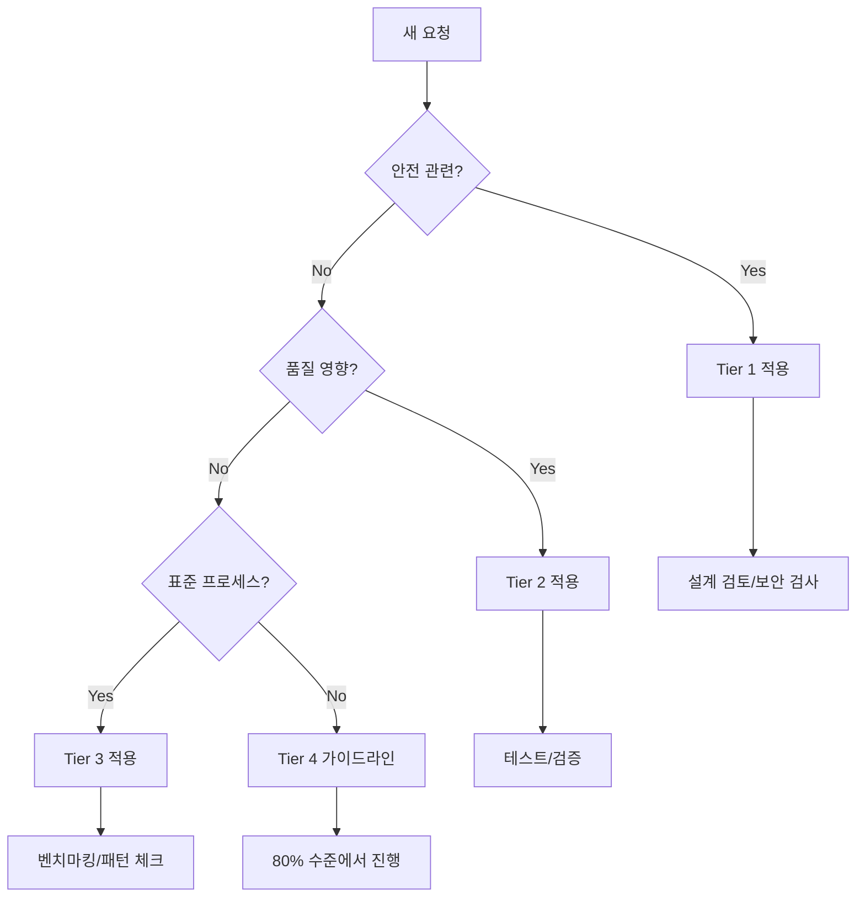

# Pattern Priority Guide - Constitution 충돌 해결 가이드

## 📊 Pattern 우선순위 매트릭스

Constitution의 여러 Pattern이 충돌할 때 적용할 우선순위 가이드입니다.

---

## 🎯 핵심 원칙

**안전 > 품질 > 효율 > 편의**

1. **안전 관련 Pattern이 항상 최우선**
2. **명시적 규칙이 암묵적 관행보다 우선**
3. **구체적 규칙이 일반 원칙보다 우선**
4. **측정 가능한 것이 추상적인 것보다 우선**

---

## 📝 Pattern 충돌 해결 규칙

### Tier 1: 절대 우선 (CRITICAL)
**절대 양보하지 않는 규칙들**

| Pattern | 설명 | 충돌 시 행동 |
|---------|------|-------------|
| **Pattern 4 (Design Review)** | 설계 검토 필수 | 새 기능은 무조건 설계 검토 |
| **P5 (Security)** | 보안 우선 | 보안 위험 있으면 중단 |
| **P10 (Encoding)** | Windows UTF-8 | 인코딩 오류면 즉시 수정 |

### Tier 2: 중요 (HIGH)
**대부분 우선하지만 상황에 따라 조정 가능**

| Pattern | 설명 | 충돌 시 행동 |
|---------|------|-------------|
| **Pattern 2 (Unverified ≠ Reject)** | 미검증 != 거부 | 혁신 보호, 파일럿 테스트 |
| **P8 (80% Coverage)** | 테스트 커버리지 | 80% 미달시 경고만 |
| **P7 (No Hallucination)** | 환각 방지 | 검증 가능한 것만 주장 |

### Tier 3: 표준 (MEDIUM)
**일반적으로 따르지만 유연하게 적용**

| Pattern | 설명 | 충돌 시 행동 |
|---------|------|-------------|
| **P16 (Benchmarking)** | 경쟁사 분석 | 신규 프로젝트만 필수 |
| **P11 (Anti-Patterns)** | 재발 방지 | 패턴 발견시 기록 |
| **P14 (Meta-Effects)** | Constitution 개선 | 주 1회 검토 |

### Tier 4: 가이드라인 (LOW)
**권장사항, 상황에 따라 스킵 가능**

| Pattern | 설명 | 충돌 시 행동 |
|---------|------|-------------|
| **P15 (80% Convergence)** | 80%면 충분 | 완벽 추구 방지 |
| **P13 (Minimal Constitution)** | 헌법 최소화 | 필요시 확장 가능 |
| **Pattern 3 (Evidence)** | 근거 기반 | 명백한 것은 스킵 |

---

## 🔄 일반적인 충돌 시나리오

### Scenario 1: Pattern 4 vs P15
**상황**: 새 기능 요청, 사용자가 빠른 구현 요구

```yaml
충돌:
  Pattern 4: "설계 검토 필수" (Tier 1)
  P15: "80%면 충분, 빠르게" (Tier 4)

해결:
  우선: Pattern 4 승리
  이유: Tier 1 > Tier 4
  행동: "설계 검토 먼저 하겠습니다 (30분 소요)"
```

### Scenario 2: P8 vs 긴급 배포
**상황**: 크리티컬 버그, 테스트 작성 시간 없음

```yaml
충돌:
  P8: "80% 테스트 커버리지" (Tier 2)
  긴급성: "즉시 배포 필요"

해결:
  우선: 긴급 배포
  이유: 크리티컬 버그는 예외 허용
  행동: "핫픽스 후 테스트 보충"
  조건: 24시간 내 테스트 추가 필수
```

### Scenario 3: Pattern 2 vs Pattern 4
**상황**: 미검증 아이디어, 설계도 불확실

```yaml
충돌:
  Pattern 2: "미검증이어도 시도" (Tier 2)
  Pattern 4: "설계 검토 필수" (Tier 1)

해결:
  우선: Pattern 4 승리
  조화: 설계 검토에서 "2-Track 파일럿" 제안
  행동: "설계 검토 → 10% 파일럿 → 측정 → 확대"
```

---

## 🎮 의사결정 플로우차트



---

## 📋 Quick Decision Matrix

| 상황 | 적용 Pattern | 스킵 가능한 것 |
|------|-------------|---------------|
| **새 기능 개발** | Pattern 4 → P8 → P16 | P15 (완벽 추구) |
| **버그 수정** | P5 → P8 | Pattern 4 (<10줄) |
| **긴급 배포** | P5 → P10 | P8 (사후 보충) |
| **리팩토링** | Pattern 4 → P4 → P8 | P16 (벤치마킹) |
| **실험적 기능** | Pattern 2 → Pattern 4 | P8 (프로토타입) |

---

## 🔧 충돌 해결 프로세스

### 1단계: Tier 확인
```python
def resolve_conflict(pattern_a, pattern_b):
    if pattern_a.tier < pattern_b.tier:
        return pattern_a  # Lower tier number = higher priority
    return pattern_b
```

### 2단계: 예외 체크
```python
EXCEPTIONS = {
    "critical_bug": ["skip_all_except_p5"],
    "prototype": ["skip_p8", "skip_p16"],
    "documentation": ["skip_pattern_4", "skip_p8"]
}
```

### 3단계: 조화 시도
```python
def harmonize_patterns(patterns):
    """충돌하는 패턴들을 조화시키기"""
    # Pattern 4 + Pattern 2 = 설계 검토에서 파일럿 제안
    # P8 + P15 = 80% 테스트면 충분
    # P16 + P15 = 2-3개 벤치마킹이면 충분
```

---

## 📊 통계 기반 우선순위 조정

### 주간 리뷰 메트릭
```yaml
pattern_effectiveness:
  pattern_4:
    prevented_issues: 15
    time_cost: 120_minutes
    roi: 1250%  # Keep HIGH priority

  p15:
    time_saved: 200_minutes
    quality_impact: -2%
    roi: 800%  # Keep LOW priority

  pattern_2:
    innovations_saved: 3
    false_positives: 1
    roi: 900%  # Keep HIGH priority
```

### 동적 조정 규칙
- ROI > 1000% → Tier 승격 검토
- ROI < 100% → Tier 강등 검토
- 충돌 빈도 > 5/week → 명확한 규칙 추가

---

## 🚀 실행 명령어

### Pattern 우선순위 확인
```bash
python scripts/pattern_priority_checker.py --check "pattern_4 vs p15"
```

### 충돌 자동 해결
```bash
python scripts/pattern_conflict_resolver.py --patterns "p4,p8,p15" --context "new_feature"
```

### 우선순위 리포트 생성
```bash
python scripts/pattern_priority_report.py --week 2025-W45
```

---

## 📝 업데이트 이력

- **2025-11-09**: 초기 버전 작성
- Pattern 4 추가에 따른 우선순위 정립
- Tier 시스템 도입 (1-4)
- 충돌 시나리오 문서화

---

**Remember**: 우선순위는 가이드일 뿐, 상황과 맥락을 고려한 판단이 중요합니다.
