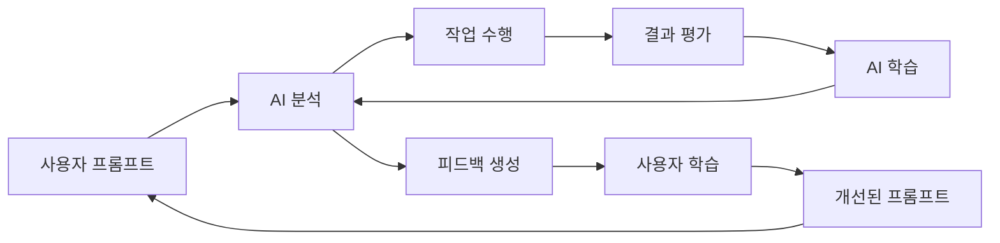

# Prompt Feedback System - AI 상호 성장 플랫폼

## 🎯 목표
AI와 사용자가 서로 피드백을 주고받으며 함께 성장하는 선순환 시스템

## 🏗️ 시스템 아키텍처

### 1. 핵심 컴포넌트

#### 📊 Prompt Analyzer (프롬프트 분석기)
```python
class PromptAnalyzer:
    """프롬프트의 논리적 구조와 품질을 분석"""

    def analyze(prompt: str) -> PromptAnalysis:
        - 논리적 일관성 점수 (0-100)
        - 구조적 명확성 점수 (0-100)
        - 컨텍스트 충실도 (0-100)
        - 개선 필요 영역 식별
```

#### 💡 Feedback Generator (피드백 생성기)
```python
class FeedbackGenerator:
    """분석 결과를 바탕으로 구체적 개선안 제시"""

    def generate_feedback(analysis: PromptAnalysis) -> Feedback:
        - 즉시 개선 가능한 제안
        - 장기적 학습 포인트
        - 모범 사례 예시
        - 대안적 접근 방법
```

#### 📈 Learning Tracker (학습 추적기)
```python
class LearningTracker:
    """사용자의 개선 패턴과 성장 추적"""

    def track_improvement(user_id: str, metrics: dict):
        - 개선 추세 분석
        - 반복되는 실수 패턴
        - 강점과 약점 프로파일
        - 맞춤형 학습 경로
```

## 🔍 분석 차원

### 1. 논리적 구조 (Logical Structure)
- **순차성**: 지시사항이 논리적 순서를 따르는가?
- **인과관계**: 원인과 결과가 명확한가?
- **완결성**: 필요한 모든 정보가 포함되어 있는가?
- **일관성**: 모순되는 지시가 없는가?

### 2. 명확성 (Clarity)
- **구체성**: 추상적 표현 vs 구체적 지시
- **모호성**: 다중 해석 가능한 표현
- **범위**: 작업 범위가 명확한가?
- **우선순위**: 중요도가 명시되어 있는가?

### 3. 컨텍스트 (Context)
- **배경정보**: 필요한 컨텍스트 제공 여부
- **제약조건**: 제한사항 명시
- **목적**: 최종 목표가 분명한가?
- **도메인**: 기술 스택, 환경 등 명시

## 📝 피드백 유형

### 1. 즉시 피드백 (Immediate Feedback)
```markdown
⚠️ **논리적 순서 개선 필요**
현재: "결과를 확인하고 → 테스트를 실행하고 → 코드를 수정해줘"
개선: "코드를 수정하고 → 테스트를 실행하고 → 결과를 확인해줘"
이유: 작업 순서가 자연스러운 개발 플로우를 따르도록
```

### 2. 구조적 피드백 (Structural Feedback)
```markdown
📋 **작업 구조화 제안**
현재: 하나의 긴 문단으로 여러 작업 나열
개선:
1. 주요 목표 명시
2. 단계별 작업 분리
3. 각 단계의 성공 기준 제시
```

### 3. 컨텍스트 피드백 (Context Feedback)
```markdown
🔍 **추가 정보 필요**
누락된 정보:
- 사용 중인 프레임워크/라이브러리
- 성능/보안 요구사항
- 에러 처리 방침
```

## 🔧 구현 전략

### Phase 1: MCP 서버 구축
```python
# mcp_prompt_feedback.py
class PromptFeedbackMCP:
    """MCP 서버로 프롬프트 피드백 제공"""

    tools = [
        "analyze_prompt",      # 프롬프트 분석
        "suggest_improvements", # 개선 제안
        "track_learning",      # 학습 추적
        "get_examples"        # 모범 사례 제공
    ]
```

### Phase 2: 실시간 통합
- Claude/GPT와 실시간 연동
- 프롬프트 입력 시 자동 분석
- 인라인 피드백 제공

### Phase 3: 학습 시스템
- 개인별 프로파일 생성
- 개선 추세 시각화
- 맞춤형 코칭 제공

## 📊 평가 메트릭

### 사용자 성장 지표
1. **명확성 개선율**: 모호한 표현 감소율
2. **구조화 수준**: 체계적 지시 증가율
3. **효율성**: 재작업 요청 감소율
4. **완성도**: 첫 시도 성공률

### AI 이해도 지표
1. **작업 정확도**: 의도한 결과 달성률
2. **추가 질문 빈도**: 명확화 요청 감소
3. **실행 속도**: 작업 완료 시간
4. **에러율**: 오해로 인한 실수 감소

## 🚀 사용 시나리오

### 시나리오 1: 초보자 지원
```python
User: "파일들 정리하고 뭔가 체계적으로 만들어줘"

Feedback:
1. 구체성 부족 (점수: 30/100)
   - "파일들" → 어떤 파일? (*.py, *.js, 전체?)
   - "정리" → 어떤 기준? (날짜, 타입, 기능?)
   - "체계적" → 원하는 구조는? (폴더 구조, 명명 규칙?)

2. 개선 예시:
   "scripts/ 폴더의 Python 파일들을 기능별로 분류하고,
   각 카테고리별 하위 폴더를 생성해서 정리해줘.
   명명 규칙은 snake_case를 따르고,
   README.md에 새로운 구조를 문서화해줘."
```

### 시나리오 2: 중급자 코칭
```python
User: "테스트 작성하고 버그 수정하고 문서 업데이트"

Feedback:
1. 순서 최적화 (점수: 60/100)
   현재는 병렬 작업처럼 나열됨

2. 개선 제안:
   "1. 먼저 기존 테스트 실행으로 현재 상태 확인
    2. 실패하는 테스트에서 버그 식별
    3. 버그 수정 후 테스트 재실행
    4. 모든 테스트 통과 확인 후 문서 업데이트"

3. 의존성 명시의 중요성 설명
```

## 🔄 피드백 루프



## 🎓 학습 경로

### Level 1: 기초 (Beginner)
- 명확한 동사 사용
- 구체적 대상 지정
- 단일 작업 집중

### Level 2: 중급 (Intermediate)
- 논리적 순서 구성
- 조건과 제약 명시
- 성공 기준 제시

### Level 3: 고급 (Advanced)
- 복잡한 워크플로우 설계
- 예외 처리 시나리오
- 성능/보안 고려사항

### Level 4: 전문가 (Expert)
- 메타 프롬프팅
- AI 특성 활용
- 창의적 문제 해결

## 🏆 게이미피케이션

### 성장 배지 시스템
- 🥉 **Clear Communicator**: 명확성 점수 80+ 달성
- 🥈 **Logic Master**: 논리 구조 90+ 유지
- 🥇 **Prompt Engineer**: 종합 점수 95+ 달성
- 💎 **AI Whisperer**: 100회 연속 개선

### 일일 챌린지
- **오늘의 미션**: "조건문 없이 복잡한 로직 표현하기"
- **주간 목표**: "평균 명확성 점수 10점 향상"

## 📱 통합 방법

### 1. VS Code Extension
```json
{
  "promptFeedback.enabled": true,
  "promptFeedback.realtime": true,
  "promptFeedback.learningMode": "adaptive"
}
```

### 2. CLI Integration
```bash
# 프롬프트 분석
prompt-feedback analyze "your prompt here"

# 학습 리포트
prompt-feedback report --period=week

# 모범 사례
prompt-feedback examples --category=refactoring
```

### 3. Web Dashboard
- 실시간 점수 모니터링
- 개선 추세 그래프
- 동료와 비교
- 학습 자료 추천

## 🔮 향후 발전 방향

### 단기 (1-3개월)
- 기본 분석 엔진 구현
- MCP 서버 통합
- 실시간 피드백 MVP

### 중기 (3-6개월)
- 학습 추적 시스템
- 개인화된 코칭
- 팀 협업 기능

### 장기 (6-12개월)
- AI 모델 미세 조정
- 도메인별 특화 피드백
- 커뮤니티 모범 사례 공유

## 💡 핵심 인사이트

> "좋은 프롬프트는 사람이 읽어도 이해하기 쉬워야 한다"

프롬프트 작성은 단순히 AI에게 지시하는 것이 아니라,
**명확한 사고를 구조화하는 과정**입니다.

이 시스템을 통해:
- 사용자는 더 명확한 사고력을 기르고
- AI는 더 정확한 작업을 수행하며
- 함께 더 나은 결과를 만들어갑니다

---

*"Teaching AI to understand us better, while learning to communicate more clearly"*
