# TDD Enforcement Guide

**Automated Test-First Development enforcement for Dev Rules Starter Kit**

## Overview

TDD Enforcer는 P8 (Test-First Development) 원칙을 자동으로 강제하는 시스템입니다.

**핵심 기능**:
- Pre-commit hook: 변경된 파일에 테스트 존재 확인
- TDD Metrics: Coverage 트렌드 및 test/code 비율 추적
- 자동 리포팅: TDD 준수 현황 모니터링

## Quick Start

### 1. TDD Enforcer 활성화

```bash
# Pre-commit hooks 설치 (자동으로 TDD enforcer 포함)
pre-commit install

# 수동 테스트
python scripts/tdd_enforcer.py scripts/example.py
```

### 2. TDD Metrics 기록

```bash
# 현재 메트릭 기록
python scripts/tdd_metrics.py record

# 리포트 확인
python scripts/tdd_metrics.py report

# 트렌드 확인
python scripts/tdd_metrics.py trend coverage
python scripts/tdd_metrics.py trend tests
```

## TDD Enforcer

### How It Works

```mermaid
graph LR
    A[git commit] --> B[Pre-commit hook]
    B --> C[TDD Enforcer]
    C --> D{Changed .py files?}
    D -->|Yes| E[Check test files]
    D -->|No| F[Allow commit]
    E --> G{Tests exist?}
    G -->|Yes| F
    G -->|No| H[⚠️  Warning]
    H --> F
```



### Exemptions

다음 파일들은 테스트가 없어도 허용됩니다:

```python
# Automatically exempt:
- __init__.py
- __main__.py
- setup.py
- conftest.py
- *_config.py
- config.py

# Exempt directories:
- tests/
- .git/
- .github/
- docs/
- config/
- RUNS/
- TASKS/
```

### Expected Test Locations

변경된 파일에 따라 다음 위치에 테스트를 찾습니다:

```
scripts/task_executor.py
→ tests/test_task_executor.py
→ tests/unit/test_task_executor.py
→ tests/integration/test_task_executor_integration.py

scripts/auth/login.py
→ tests/test_login.py
→ tests/unit/test_login.py
```

### Bypass Hook (Not Recommended)

긴급한 경우에만 사용:

```bash
# Skip all pre-commit hooks
git commit --no-verify -m "hotfix: critical bug"

# ⚠️  Warning: Override usage is tracked
# Use only when:
# - Emergency hotfix required
# - Tests will be added in immediate follow-up commit
```

## TDD Metrics

### Tracked Metrics

| Metric | Description | Target |
|--------|-------------|--------|
| **Coverage %** | Code coverage percentage | ≥5% (Phase 4) |
| **Test Count** | Total number of tests | Growing |
| **Test/Code Ratio** | Tests per line of code | ≥0.5 |
| **Coverage Velocity** | Rate of coverage improvement | Positive |

### Recording Metrics

```bash
# After running tests with coverage
pytest tests/unit/ --cov=scripts --cov-report=json

# Record metrics
python scripts/tdd_metrics.py record

# Output:
# ✓ Metrics recorded at 2025-11-01T10:30:00
#   Coverage: 5.12%
#   Tests: 92
```

### Viewing Reports

#### Full Report

```bash
python scripts/tdd_metrics.py report
```

```
============================================================
TDD Metrics Report
============================================================

Timestamp: 2025-11-01T10:30:00
Git Commit: be6979d2

Coverage:
  Current: 5.12%
  Lines: 883/18,295
  Missing: 17,412
  Trend: 📈 up (+0.15% from last)

Tests:
  Total: 92
  Unit: 92
  Integration: 0
  Trend: 📈 up (+22 tests from last)

Code Metrics:
  Code Lines: 15,234
  Test/Code Ratio: 0.006
  Tests per 100 LOC: 0.6

============================================================
```

#### Coverage Trend

```bash
python scripts/tdd_metrics.py trend coverage
```

```
Coverage Trend (last 10 records)
============================================================
2025-10-31: ████████████████████ 0.18
2025-11-01: ██████████████████████████████████████████ 5.12
============================================================
Range: 0.18 - 5.12
Latest: 5.12
Change: +4.94
```

#### Test Count Trend

```bash
python scripts/tdd_metrics.py trend tests
```

```
Tests Trend (last 10 records)
============================================================
2025-10-31: ██████████████ 15
2025-10-31: ████████████████████ 40
2025-11-01: ████████████████████████ 52
2025-11-01: █████████████████████████████ 70
2025-11-01: ████████████████████████████████████████ 92
============================================================
Range: 15 - 92
Latest: 92
Change: +77
```

## Workflows

### Development Workflow (TDD)

```bash
# 1. Write failing test first
vim tests/unit/test_new_feature.py

# 2. Run test (should fail)
pytest tests/unit/test_new_feature.py -v
# ✗ FAILED (as expected)

# 3. Implement feature
vim scripts/new_feature.py

# 4. Run test (should pass)
pytest tests/unit/test_new_feature.py -v
# ✓ PASSED

# 5. Record metrics
pytest tests/unit/ --cov=scripts --cov-report=json
python scripts/tdd_metrics.py record

# 6. Commit (TDD enforcer will check)
git add tests/unit/test_new_feature.py scripts/new_feature.py
git commit -m "feat: add new feature"

# Output:
# === TDD Enforcer (P8 Test-First Development) ===
# ✓ Has tests: scripts/new_feature.py -> test_new_feature.py
# ✅ All changed files have test coverage!
```

### Adding Tests to Existing Code

```bash
# 1. Modify existing code
vim scripts/existing_module.py

# 2. Commit attempt (will warn)
git add scripts/existing_module.py
git commit -m "refactor: improve existing module"

# Output:
# === TDD Enforcer (P8 Test-First Development) ===
# ✗ Missing tests: scripts/existing_module.py
#   Expected test file (one of):
#     tests/test_existing_module.py
#     tests/unit/test_existing_module.py
#   TDD requires tests BEFORE implementation (P8)
#
# ⚠️  WARNING: Some files lack test coverage
# Options:
#   1. Add tests for the changed files
#   2. Skip hook (only if tests will be added in follow-up commit):
#      git commit --no-verify

# 3. Add tests
vim tests/unit/test_existing_module.py

# 4. Commit with tests
git add tests/unit/test_existing_module.py
git commit -m "test: add tests for existing module"
```

### CI/CD Integration

TDD metrics are automatically tracked in CI/CD:

```yaml
# .github/workflows/unit-tests.yml (already configured)
- name: Run unit tests with coverage
  run: |
    pytest tests/unit/ --cov=scripts --cov-report=json

- name: Check Phase 4 coverage threshold
  run: |
    python scripts/tdd_metrics.py record
    # Threshold: >=5%
```

## Best Practices

### 1. Write Tests First

```python
# ❌ Bad: Implementation first
def calculate_total(items):
    return sum(item.price for item in items)

# Later...
def test_calculate_total():  # Afterthought
    pass

# ✅ Good: Test first
def test_calculate_total():
    """총합 계산이 정확하다"""
    items = [Item(price=10), Item(price=20)]
    assert calculate_total(items) == 30

# Then implement
def calculate_total(items):
    return sum(item.price for item in items)
```

### 2. Small, Incremental Changes

```bash
# ✅ Good: Small commits with tests
git commit -m "test: add test for user login"
git commit -m "feat: implement user login"

# ❌ Bad: Large commits without tests
git commit -m "feat: add entire auth system"  # No tests
```

### 3. Monitor Trends

```bash
# Weekly practice
python scripts/tdd_metrics.py report

# Check if coverage is improving
python scripts/tdd_metrics.py trend coverage

# Target: Positive velocity
```

### 4. Test Coverage Goals

| Phase | Target | Status |
|-------|--------|--------|
| Phase 4 | 5% | ✅ Achieved |
| Phase 5 | 30% | 🔮 Future |
| Long-term | 80% | 🎯 Aspirational |

**P15 Convergence**: Don't chase 100%. Focus on critical code.

## Troubleshooting

### False Positives

```bash
# Problem: TDD enforcer warns about config file
✗ Missing tests: scripts/app_config.py

# Solution 1: File should be exempt
# Add to exempt_patterns in scripts/tdd_enforcer.py:
exempt_patterns = [
    "*_config.py",  # Already there
]

# Solution 2: Use --no-verify (rare)
git commit --no-verify -m "config: update settings"
```

### Metrics Not Recording

```bash
# Problem: "No coverage data available"

# Solution: Run tests with coverage first
pytest tests/unit/ --cov=scripts --cov-report=json

# Then record
python scripts/tdd_metrics.py record
```

### Test File Not Found

```bash
# Problem: TDD enforcer can't find test file

# Check expected locations:
# - tests/test_module.py
# - tests/unit/test_module.py
# - tests/integration/test_module_integration.py

# Create in correct location
mkdir -p tests/unit
vim tests/unit/test_module.py
```

## Configuration

### TDD Enforcer Settings

Edit `scripts/tdd_enforcer.py`:

```python
# Exempt patterns
exempt_patterns = [
    "__init__.py",
    "__main__.py",
    # Add your patterns here
]

# Exempt directories
exempt_dirs = [
    "tests",
    ".git",
    # Add your directories here
]

# Enforcement mode
# Exit 0: Warning only (current)
# Exit 1: Block commits without tests
sys.exit(0)  # Change to sys.exit(1) for strict mode
```

### TDD Metrics Settings

Edit `scripts/tdd_metrics.py`:

```python
# Metrics file location
self.metrics_file = self.project_root / "RUNS" / "tdd_metrics.json"

# History limit
if len(data["history"]) > 100:  # Keep last 100
    data["history"] = data["history"][-100:]
```

## Integration with Constitution

### P8: Test-First Development

```yaml
# config/constitution.yaml (Article P8)
P8_TEST_FIRST:
  description: "Write tests before implementation"
  enforcement:
    - TDD Enforcer pre-commit hook
    - Coverage threshold (≥5%)
    - TDD metrics tracking

  compliance:
    - All new code has tests
    - Tests written before implementation
    - Coverage improving over time
```

### Evidence Collection (P2)

```bash
# TDD metrics stored as evidence
RUNS/tdd_metrics.json

# Coverage reports
coverage.json
htmlcov/

# Tracked in git commits
git log --grep="test:"
```

## Related Documentation

- [TESTING_STRATEGY.md](./TESTING_STRATEGY.md) - Comprehensive testing guide
- [CLAUDE.md](../CLAUDE.md) - Project setup and commands
- [config/constitution.yaml](../config/constitution.yaml) - P8 definition

## Summary

**TDD Enforcer = Automated TDD Compliance**

✅ **Pre-commit checks** - Test existence validation
✅ **Metrics tracking** - Coverage and test trends
✅ **CI/CD integration** - Automated enforcement
✅ **P8 compliance** - Constitutional alignment

**Philosophy**: Tests first, quality built-in, metrics-driven improvement

---

**Last Updated**: 2025-11-01
**Status**: Active (Phase 4)
**Coverage Target**: ≥5%
